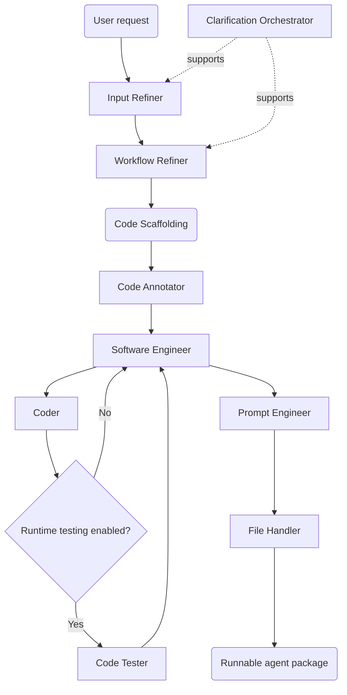

# From Natural Language Requests to Runnable AI Agents:<br>A Multi-Agent Builder for Custom AI Agents (MABCA)

**MABCA** is a framework that automatically transforms a natural-language request into a runnable, (multi-)agent Python application. The system combines requirement refinement, workflow design, code scaffolding, structured code annotation, iterative implementation, isolated execution-based testing, prompt engineering, and file generation in one end-to-end pipeline.

---

## Contents

- [System overview](#system-overview)
- [Architecture](#architecture)
- [Core generation pipeline](#core-generation-pipeline)
- [Supporting agents](#supporting-agents)
- [Repository structure](#repository-structure)
- [Requirements](#requirements)
- [Installation](#installation)
- [Configuration](#configuration)
- [Running the system](#running-the-system)
- [Generated output](#generated-output)
- [Isolated code testing](#isolated-code-testing)
- [Experiments and evaluation](#experiments-and-evaluation)
- [Benchmark results included in the repository](#benchmark-results-included-in-the-repository)
- [Reproducing the benchmarks](#reproducing-the-benchmarks)
- [Ablation study](#ablation-study)
- [Development](#development)
- [Reproducibility notes and limitations](#reproducibility-notes-and-limitations)
- [Citation](#citation)
- [Author](#author)

---

## System overview

MABCA accepts a user request such as:

> Build an agent that receives receipt images, extracts the purchase information, stores the data in an Excel file, and answers questions about the user's spending.

The system progressively converts that request into executable source code. It first clarifies what should be built, then defines an explicit workflow graph, creates the initial code structure, fills in implementation details, tests generated functions when runtime testing is enabled, writes and validates prompts, and creates any additional files required by the generated agent.

A typical run produces one or more Python agents under `creations/<agent_name>/`, together with prompt modules and any supporting files required by the generated workflow.

### Design goals

The system is designed around four goals:

1. **Structured decomposition**: separate requirement engineering, workflow design, implementation, testing, and prompt construction into specialized stages.
2. **Executable output**: produce Python code that can be run and further inspected.
3. **Feedback and verification**: allow human review and model-based review at multiple stages, with optional runtime validation inside Docker containers.
4. **Reproducible evaluation**: keep generated benchmark agents, benchmark runners, outputs, and ablation variants in the repository.

---

## Architecture



The main workflow is implemented in `main_workflow/main.py`. It invokes the major stages in sequence and passes structured state between them.

---

## Core generation pipeline

| Stage | Component | Responsibility |
|---|---|---|
| 1 | **Input Refiner** | Corrects and clarifies the raw request, resolves missing details, and produces a more precise implementation-ready specification. |
| 2 | **Workflow Refiner** | Converts the refined request into a structured `WorkflowBundle` containing a root workflow graph and optional subgraphs. |
| 3 | **Code Scaffolding** | Deterministically converts the workflow description into LangGraph-oriented Python skeletons and prompt modules under `creations/`. Each graph is converted into a single Python file. The following agents are invoked in sequence for each file. |
| 4 | **Code Annotator** | Expands the scaffold with node documentation, schemas, helper-function stubs, tool stubs, and LLM configuration proposals. Adds design principles and implementation guidance. |
| 5 | **Software Engineer** | Coordinates multiple Coder subagents to implement the file, and performs final code review. |
| 6 | **Coder** | Implements individual functions and proposes required imports, helper functions, or tools. Uses the Code Tester to validate runtime behaviour. |
| 7 | **Code Tester** | Executes proposed functions in isolated Docker containers and returns runtime evidence to the implementation loop. |
| 8 | **Prompt Engineer** | Generates, reviews, formats, tests, and writes prompt templates used by LLM nodes. |
| 9 | **File Handler** | Creates additional files and directories required by the generated application. |

### Workflow representation

The Workflow Refiner emits a structured bundle with:

- one root `WorkflowGraph`
- zero or more subgraphs
- named nodes
- directed edges
- graph-level memory configuration
- node descriptions that specify expected execution type, such as code, LLM, LLM with tools, or subgraph execution

The scaffold generator in `utils/build_code.py` converts this representation into Python files containing LangGraph state, nodes, conditional routing, graph construction, and prompt references.

---

## Supporting agents

The repository currently contains the following specialized agents under `agents/`:

| Agent | Role |
|---|---|
| `clarificationOrchestrator` | Answers clarification questions from previously supplied context when possible. |
| `inputRefiner` | Refines the user's initial requirements. |
| `workflowRefiner` | Designs the executable workflow structure. |
| `codeAnnotator` | Enriches generated scaffolds before implementation. |
| `softwareEngineer` | Coordinates implementation and review. |
| `coder` | Implements individual functions. |
| `codeTester` | Executes generated function implementations in isolated Docker containers and reviews the results. |
| `promptEngineer` | Creates and tests prompt templates. |
| `fileHandler` | Creates supporting files and folders. |
| `researcher` | Performs focused web research and returns a consolidated result. |
| `deepResearcher` | Splits larger research tasks into smaller questions and combines Researcher outputs. |

The agent folders also include their own `readme.md` with the component's state schema, graph structure, tools, behavior, and direct invocation examples.

---

## Repository structure

```text
.
├── agents/
│   ├── clarificationOrchestrator/
│   │   ├── graphs/
│   │   │   └── clarification_orchestrator_app.png
│   │   ├── clarification_orchestrator.py
│   │   ├── prompts.py
│   │   └── readme.md
│   ├── codeAnnotator/
│   │   └── ...
│   ├── codeTester/
│   │   ├── ...
│   │   ├── code_tester.py
│   │   ├── isolated_execution.py
│   │   └── Dockerfile.code-tester
│   ├── coder/
│   │   └── ...
│   ├── deepResearcher/
│   │   └── ...
│   ├── fileHandler/
│   │   └── ...
│   ├── inputRefiner/
│   │   └── ...
│   ├── promptEngineer/
│   │   └── ...
│   ├── researcher/
│   │   └── ...
│   ├── softwareEngineer/
│   │   └── ...
│   └── workflowRefiner/
│       └── ...
│
├── creations/
│   ├── math_assistant/
│   └── menu_recommendation_workflow/
│
├── experiments/
│   ├── ablation_study/
│   │   ├── ablate_all/
│   │   ├── no_requirement_engineering/
│   │   ├── no_design/
│   │   ├── no_implementation/
│   │   ├── no_feedback/
│   │   └── full_framework/
│   └── benchmarks/
│       ├── problem_solution_pipeline/
│       ├── ifeval_solver_pipeline/
│       └── gaia_task_solver/
│
├── main_workflow/
│   ├── ablate_all.py
│   ├── ablate_req_eng.py
│   ├── ablate_design.py
│   ├── ablate_implementation.py
│   └── main.py
│
├── utils/
│   ├── build_code.py
│   └── utils.py
│
├── create_agent.py
├── requirements.txt
├── sitecustomize.py
├── .env.example
└── README.md
```

Generated files, execution logs, benchmark outputs, and experimental artifacts may add further directories beneath these paths.

---

## Requirements

### Base system

- **Python 3.11** is recommended. The isolated code-testing image also uses Python 3.11.
- An **OpenAI-compatible chat model provider** supported through `langchain-openai`.
- API credentials for the selected model provider.
- **Tavily API access** for components that use Tavily search.
- **LangSmith** is used for tracing in the current workflow configuration.

The base Python dependencies are pinned in `requirements.txt`, including:

- LangGraph `0.6.3`
- LangChain `0.3.27`
- LangChain OpenAI `0.3.28`
- LangChain Tavily `0.2.11`
- LangSmith `0.4.10`

### Docker

Docker is required when:

- `coder_run_code=True` is used in the main generation workflow
- the Code Tester is invoked directly
- benchmark runners use Docker-backed execution or evaluation
- GAIA executes generated Python code in its isolated runtime

---

## Installation

Clone the repository and create a Python virtual environment:

```bash
git clone https://github.com/stefanosPanteli/EPL-thesis.git
cd EPL-thesis
python -m venv venv
```

Activate the environment.

### Windows PowerShell

```powershell
.\venv\Scripts\Activate.ps1
pip install -r requirements.txt
$env:PYTHONPATH = (Get-Location)
```

### Linux or macOS

```bash
source venv/bin/activate
pip install -r requirements.txt
export PYTHONPATH="$PWD"
```

Copy the environment template:

```bash
cp .env.example .env
```

On Windows PowerShell:

```powershell
Copy-Item .env.example .env
```

Then configure the required credentials in `.env`.

---

## Configuration

The model wrapper in `utils/utils.py` reads the provider, base URL, API key, and model name from environment variables.

A minimal configuration using OpenRouter is:

```dotenv
PROVIDER='OPENROUTER'
OPENROUTER_API_KEY='your-api-key'
OPENROUTER_BASE_URL='https://openrouter.ai/api/v1'
MODEL_NAME='your-model-name'

TAVILY_API_KEY='your-tavily-key'

LANGCHAIN_API_KEY='your-langsmith-key'
LANGSMITH_API_KEY='your-langsmith-key'
LANGCHAIN_TRACING_V2=true
LANGSMITH_TRACING=true

DEBUG=1
```

Other OpenAI-compatible providers can be selected by setting:

```dotenv
PROVIDER='PROVIDER_NAME'
PROVIDER_NAME_API_KEY='...'
PROVIDER_NAME_BASE_URL='...'
MODEL_NAME='...'
```

`myChatOpenAI` automatically resolves `{PROVIDER}_API_KEY`, `{PROVIDER}_BASE_URL`, and `MODEL_NAME`.

### Debug mode

Set:

```dotenv
DEBUG=1
```

to print node-level execution information and enable workflow logging. When debug logging is active, the main workflow stores intermediate state and generated source snapshots under its `logs/<run_name>/` directory.

---

## Running the system

### Important execution-directory requirement

`utils/build_code.py` currently writes generated agents to `../creations/` using a relative path. Run the main workflow **from the `main_workflow/` directory** so generated files are written to the repository's `creations/` directory.

From the repository root:

### Windows PowerShell

```powershell
$env:PYTHONPATH = (Get-Location)
cd main_workflow
python main.py run_name # only for logging
```

### Linux or macOS

```bash
export PYTHONPATH="$PWD"
cd main_workflow
python main.py run_name # only for logging
```

The positional argument is the run name used for debug logs.

### CLI behavior

The `main.py` command-line entry point runs the receipt-management example request embedded in the file.

For a custom request, just change the `user_request` variable in the `main.py` file.

```python
user_request = """
Build an agent that answers questions over a collection of academic notes, keeps conversational memory, and cites the source file used for each answer.
"""

main(
    user_request= user_request,
    orchestrator= True or False,
    prompt_review_mode= "llm" or "user" or "both",
    coder_run_code= True or False,
)
```

### Main workflow options

| Argument | Meaning |
|---|---|
| `user_request` | Natural-language description of the agent to build. |
| `orchestrator` | When `True`, internal clarification can reuse prior context through the Clarification Orchestrator. |
| `prompt_review_mode` | `"llm"`, `"user"`, or `"both"`. Controls Prompt Engineer review. `"user"` and `"both"` are interactive. |
| `coder_run_code` | When `True`, Coder proposals can be checked by the Code Tester through isolated execution. |
| `run_name` | Directory name used for debug logs. |

Several pipeline stages support interactive confirmation. For unattended runs you can just press enter.

---

## Generated output

For a root workflow named `example_agent`, the scaffold generator creates a structure similar to:

```text
creations/
└── example_agent/
    ├── example_agent.py
    ├── example_agent_prompts.py
    ├── optional_subgraph.py
    ├── optional_subgraph_prompts.py
    └── additional_files_created_by_file_handler
```

Generated Python files contain:

- state schemas
- tool definitions
- LLM instances
- helper functions
- LangGraph nodes
- conditional routing functions
- graph construction
- optional `MemorySaver` checkpoints
- a local testing section

The Prompt Engineer writes prompt constants into the corresponding `*_prompts.py` modules.

---

## Isolated code testing

The Code Tester adds runtime evidence to the implementation loop. It receives an implementation of one function, generates meaningful keyword-argument inputs, executes each input separately, and reviews the implementation together with outputs, exceptions, tracebacks, and execution times.

### Build the Code Tester image

From the repository root:

```bash
docker build \
  -f agents/codeTester/Dockerfile.code-tester \
  -t thesis-code-tester:latest \
  .
```

PowerShell equivalent:

```powershell
docker build `
  -f agents\codeTester\Dockerfile.code-tester `
  -t thesis-code-tester:latest `
  .
```

### Isolation model

The Code Tester:

- checks that Docker is available
- builds candidate source from the original file, required imports, and the proposed function implementation
- executes each generated input in a separate container
- captures return values, errors, tracebacks, output types, and durations
- continues testing later inputs if one input fails
- returns the execution report to a reviewer model

This mechanism is intended to reduce the risk of accepting code based only on static model review. It is still a research sandbox and should not be treated as a complete security boundary for hostile code.

---

## Experiments and evaluation

The repository contains two main forms of evaluation:

1. **Generated-agent benchmarks** under `experiments/benchmarks/`
2. **Framework ablations** under `experiments/ablation_study/` and `main_workflow/ablate_*.py`

The benchmark directories include the generated benchmark agents, runners, run configurations, raw generations, evaluation outputs, and score summaries used for analysis.

### Benchmark pipelines

| Benchmark | Generated agent / runner | Purpose |
|---|---|---|
| HumanEval / HumanEval+ | `problem_solution_pipeline` | Evaluates generated Python solutions using EvalPlus base and extended tests. |
| MBPP / MBPP+ | `problem_solution_pipeline` | Evaluates generated MBPP solutions using EvalPlus base and extended tests. |
| IFEval | `ifeval_solver_pipeline` | Evaluates instruction-following under strict and loose official IFEval criteria. |
| GAIA | `gaia_task_solver` | Evaluates tool-using question answering on the GAIA validation split. |

---

## Benchmark results included in the repository

The following values are computed from the complete result artifacts currently stored in this repository snapshot.

| Benchmark artifact | Result |
|---|---:|
| HumanEval, `humaneval_plus_full_final` | 161 / 164 = **98.17%** |
| HumanEval+, `humaneval_plus_full_final` | 150 / 164 = **91.46%** |
| MBPP | 376 / 378 = **99.47%** |
| MBPP+ | 315 / 378 = **83.33%** |
| IFEval strict prompt-level | 489 / 541 = **90.39%** |
| IFEval strict instruction-level | 774 / 834 = **92.81%** |
| IFEval loose prompt-level | 497 / 541 = **91.87%** |
| IFEval loose instruction-level | 784 / 834 = **94.00%** |
| GAIA validation | 133 / 165 = **80.61%** |
| GAIA Level 1 | 47 / 53 = **88.68%** |
| GAIA Level 2 | 67 / 86 = **77.91%** |
| GAIA Level 3 | 19 / 26 = **73.08%** |

---

## Reproducing the benchmarks

### HumanEval / HumanEval+

Install EvalPlus:

```bash
pip install --upgrade evalplus
```

Run from `experiments/benchmarks/problem_solution_pipeline/`:

```bash
python run_humaneval_plus_benchmark.py \
  --output-dir ./benchmark_results/humaneval/humaneval_plus_full \
  --evaluation-mode docker
```

A short smoke test can be run with:

```bash
python run_humaneval_plus_benchmark.py \
  --limit 3 \
  --output-dir ./benchmark_results/humaneval/humaneval_plus_test \
  --evaluation-mode none
```

### MBPP / MBPP+

With EvalPlus installed, run:

```bash
python run_mbpp_plus_benchmark.py \
  --output-dir ./benchmark_results/mbpp/mbpp_plus_full \
  --evaluation-mode docker
```

Smoke test:

```bash
python run_mbpp_plus_benchmark.py \
  --limit 3 \
  --output-dir ./benchmark_results/mbpp/mbpp_plus_test \
  --evaluation-mode docker
```

### IFEval

Install the IFEval evaluator dependencies:

```bash
pip install "lm_eval[ifeval]"
```

Run from `experiments/benchmarks/ifeval_solver_pipeline/`:

```bash
python run_ifeval_benchmark.py \
  --output-dir ./benchmark_results/ifeval/ifeval_full \
  --max-parallel-tasks 2 \
  --task-timeout-seconds 300
```

Smoke test:

```bash
python run_ifeval_benchmark.py \
  --limit 3 \
  --output-dir ./benchmark_results/ifeval/ifeval_test
```

### GAIA

Install the dataset dependencies:

```bash
pip install -U datasets huggingface_hub
```

GAIA is distributed through a gated Hugging Face dataset. Accept the dataset conditions and authenticate with Hugging Face before running the full evaluation.

Run from `experiments/benchmarks/gaia_task_solver/`:

```bash
python run_gaia_task_solver.py \
  --output-dir ./benchmark_results/gaia_task_solver/gaia_validation_full \
  --task-timeout 300
```

Smoke test:

```bash
python run_gaia_task_solver.py \
  --limit 3 \
  --output-dir ./benchmark_results/gaia_task_solver/gaia_validation_test
```

All benchmark runners support additional options for subsets, task selection, resuming interrupted runs, timeouts, and output directories. Run the relevant script with `--help` for the complete interface.

---

## Ablation study

The repository includes ablated workflow variants used to isolate the contribution of major system stages.

### Main workflow ablations

| Script | Main change |
|---|---|
| `main_workflow/ablate_req_eng.py` | Removes the full requirement-engineering path and uses the ablated workflow-refinement configuration. |
| `main_workflow/ablate_design.py` | Replaces the full Code Annotator with its ablated variant. |
| `main_workflow/ablate_implementation.py` | Replaces the full Software Engineer with its ablated implementation variant. |
| `main_workflow/ablate_all.py` | Uses a single model-driven generation path instead of the full staged framework. |

Additional ablated component implementations are stored beside the full agents, including variants of the Input Refiner, Workflow Refiner, Code Annotator, Software Engineer, Coder, and Prompt Engineer.

The generated applications and execution artifacts used for the ablation study are stored under:

```text
experiments/ablation_study/
├── full_framework/
├── no_requirement_engineering/
├── no_design/
├── no_implementation/
├── no_feedback/
└── ablate_all/
```

---

## Development

### Create a new internal agent scaffold

The repository includes a small helper for creating a new agent directory:

```bash
python create_agent.py <agent_name>
```

The generated scaffold contains the new agent module, a prompt module, a graph output directory, standard imports, model setup, and placeholders for schemas, tools, nodes, and graph construction.

### Component-level execution

Each major agent exposes a compiled LangGraph app, for example:

```python
from agents.workflowRefiner.workflow_refiner import workflow_refiner_app
```

The component-level `readme.md` files document the expected input state and output schema for direct use.

---

## Reproducibility notes and limitations

### Model dependence

Results depend on the configured provider and `MODEL_NAME`. Hosted models can change over time even when the model identifier remains constant.

### Interactive stages

The full generation workflow contains human-confirmation paths. In particular, requirement refinement, workflow refinement, code annotation, and some prompt-review modes can request terminal input. This is useful for human-in-the-loop generation.

### Relative paths

The current scaffold generator uses relative output paths. Run `main.py` from the `main_workflow/` directory unless the path handling is changed.

### External services

Some agents rely on external model APIs, Tavily, LangSmith, web access, or benchmark datasets. Reproduction therefore requires the corresponding credentials and service availability.

### Runtime testing

Docker-based execution reduces direct exposure of the host environment and provides useful dynamic evidence, but it is not presented as a hardened sandbox for adversarial code.

### Generated software

MABCA produces executable code automatically. Generated applications can still contain logic errors, insecure operations, inappropriate dependencies, or incorrect assumptions. Review generated code before using it with sensitive data or deploying it outside an experimental environment.

---

## Author

**Stefanos Panteli**

Repository: <https://github.com/stefanosPanteli/EPL-thesis>
