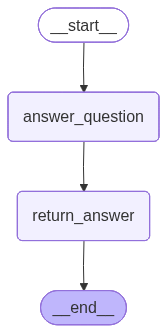

> `author:` Stefanos Panteli<br>
`date:` 2025-10-25<br>
`description:` This agent is used by the clarifying agents as a middle-man, between the user and the clarifying agents. Its role is to answer the questions raised by the clarifying agents and answer them if the user answered something similar. It has internal memory through langgraph's memory store.

<br>

# **Table of contents**
&emsp;&emsp;&emsp;🗂️ [**Folder Structure**](#folder-structure)<br>
&emsp;&emsp;&emsp;✅ [**Purpose**](#purpose)<br>
&emsp;&emsp;&emsp;▶️ [**Entry point**](#entry-point)<br>
&emsp;&emsp;&emsp;📥📤 [**Interface**](#interface)<br>
&emsp;&emsp;&emsp;&emsp;&emsp;&emsp;&emsp;📥 [Input](#input)<br>
&emsp;&emsp;&emsp;&emsp;&emsp;&emsp;&emsp;📤 [Output](#output)<br>
&emsp;&emsp;&emsp;🧰 [**Tools and Structured Output**](#tools-and-structured-output)<br>
&emsp;&emsp;&emsp;&emsp;&emsp;&emsp;&emsp;🛠️ [Tools](#tools)<br>
&emsp;&emsp;&emsp;&emsp;&emsp;&emsp;&emsp;🧾 [Structured Output](#structured-output)<br>
&emsp;&emsp;&emsp;📌 [**Behaviour rules**](#behavior-rules)<br>
&emsp;&emsp;&emsp;🧭 [**Graph structure**](#graph-structure)<br>
&emsp;&emsp;&emsp;&emsp;&emsp;&emsp;&emsp;🧩 [Nodes](#nodes)<br>
&emsp;&emsp;&emsp;&emsp;&emsp;&emsp;&emsp;🔀 [Edges](#edges)<br>
&emsp;&emsp;&emsp;&emsp;&emsp;&emsp;&emsp;🌟 [Graph visualised](#graph-visualised)<br>
&emsp;&emsp;&emsp;🚀 [**Quickstart**](#quickstart)<br>

<br>

# **Folder Structure**
```python
    clarificationOrchestrator/
    ├── graphs/
    │   └── clarification_orchestrator_app.png      # The graph visualised.
    ├── clarification_orchestrator.py               # The langgraph implementation of the agent.
    ├── prompts.py                                  # The prompts used to power the agent.
    └── readme.md                                   # This file.
```

<br><br>

# **Purpose**
This agent answers clarification questions using only prior user answers stored in memory.
If the memory does not contain the answer, it marks the question as unanswered so the user can answer it.
A confidence score is generated by the agent in order to assess the quality of the agent's response.

<br>

# **Entry point**
- App: `clarification_orchestrator_app`
- Module: `agents/clarificationOrchestrator/clarification_orchestrator.py`

<br>

# **Interface**
## Input
### InputSchema (Pydantic)
- `question: str` The clarification question raised by another agent.
- `questions_answers: Annotated[List[QnA], add]` Accumulated memory of prior QnA items. This is updated across calls.
    - `question: str` The clarification question raised by another agent.
    - `answer: str` The agent's response to the clarification question.
    - `justification: str` The justification for the agent's response. Used as a thought process to reduce hallucinations.

## Output
### OutputSchema (TypedDict)
- `qna: QnA`  The final QnA to answer the clarification question.

> *Notes*: The graph returns only the last QnA item in state: `state.questions_answers[-1]`.

<br>

# **Tools and Structured Output**
## Tools
No tools are used by this agent.

## Structured Output
### CoordinatorSchema (Pydantic)
- `qna: Optional[List[QnA]]` A list of the questions of the clarifying agents and their answers provided by the orchestrator.
    - `question: str` The clarification question raised by another agent.
    - `answer: str` The agent's response to the clarification question.
    - `justification: str` The justification for the agent's response. Used as a thought process to reduce hallucinations.
- `score: float` The confidence score of the agent's response.
- `unanswered_questions: Optional[List[str]]` A list of questions that the agent did not answer, and the user must answer.

<br>

# **Behaviour rules**
- Uses the LLM with structured output `CoordinatorSchema`.
- Only human messages count as source of truth for the LLM, passed through the prompt.
- If `response.score <= 0.8`, it asks the user directly and stores the reply.
- If `response.unanswered_questions` exists, it asks the user for those too and appends the reply.
- On Pydantic validation error, it asks the user directly.

<br>

# **Graph structure**
## Nodes
1. **`answer_question`**
    - Builds prompt from `prompts.ANSWER_QUESTION_PROMPT`.
    - Converts memory `QnA` into messages:
        - AIMessage holds prior questions.
        - HumanMessage holds prior answers.
    - Calls LLM via `safe_invoke`.
    - If low confidence or missing info, asks user via `input(...)`.
    - Appends a new `QnA` into `questions_answers` and returns it in state.

2. **`return_answer`**
    - Returns `state.questions_answers[-1]` through the `OutputSchema`.

## Edges
- *START* → **`answer_question`** → **`return_answer`** → *END*

## Graph visualised
<div align="center">
  
</div>

<br>

# **Quickstart**
```python
from agents.clarificationOrchestrator.clarification_orchestrator import clarification_orchestrator_app

graph_input = {
    "question": "Clarification: Do you mean [X]?"
}

response = clarification_orchestrator_app.invoke(graph_input)

# response example:
# {
#   "qna": {
#     "question": "Clarification: 1. Do you mean [X]? 2. Will [Y] be done with [W]?",
#     "answer": "1. Yes. 2. No, it will be like [Z].",
#     "justification": "User previously answered [V] to [X2]. User just provided the answer for [Y]."
#   }
# }
```