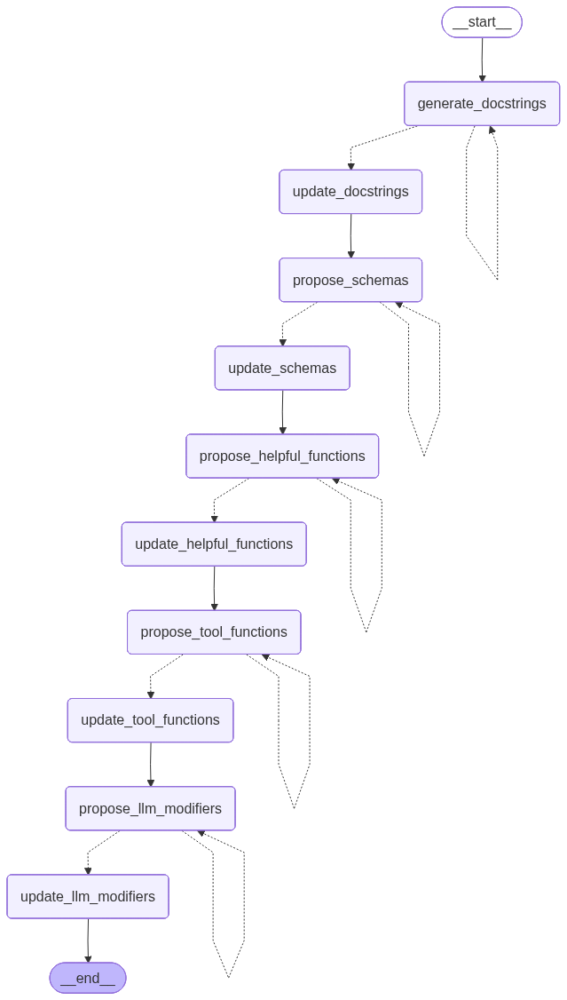

> `author:` Stefanos Panteli<br>
`date:` 2025-10-26<br>
`description:` The Code Annotator agent. It reads the proposed code structure and adds detailed definitions and instructions for nodes, schemas, helpful functions, tool functions, and LLM modifiers. It drives an interactive approval loop for each step.

<br>

# **Table of contents**
&emsp;&emsp;&emsp;🗂️ [**Folder Structure**](#folder-structure)<br>
&emsp;&emsp;&emsp;✅ [**Purpose**](#purpose)<br>
&emsp;&emsp;&emsp;▶️ [**Entry point**](#entry-point)<br>
&emsp;&emsp;&emsp;📥📤 [**Interface**](#interface)<br>
&emsp;&emsp;&emsp;&emsp;&emsp;&emsp;&emsp;📥 [Input](#input)<br>
&emsp;&emsp;&emsp;&emsp;&emsp;&emsp;&emsp;📤 [Output](#output)<br>
&emsp;&emsp;&emsp;🧰 [**Tools and Structured Output**](#tools-and-structured-output)<br>
&emsp;&emsp;&emsp;&emsp;&emsp;&emsp;&emsp;🛠️ [Tools](#tools)<br>
&emsp;&emsp;&emsp;&emsp;&emsp;&emsp;&emsp;🧾 [Structured Output](#structured-output)<br>
&emsp;&emsp;&emsp;📌 [**Behaviour rules**](#behavior-rules)<br>
&emsp;&emsp;&emsp;🧭 [**Graph structure**](#graph-structure)<br>
&emsp;&emsp;&emsp;&emsp;&emsp;&emsp;&emsp;🧩 [Nodes](#nodes)<br>
&emsp;&emsp;&emsp;&emsp;&emsp;&emsp;&emsp;🔀 [Edges](#edges)<br>
&emsp;&emsp;&emsp;&emsp;&emsp;&emsp;&emsp;🌟 [Graph visualised](#graph-visualised)<br>
&emsp;&emsp;&emsp;🚀 [**Quickstart**](#quickstart)<br>

<br>

# **Folder Structure**
```python
    codeAnnotator/
    ├── graphs/
    │   └── code_annotator_app.png  # The graph visualised.
    ├── code_annotator.py           # The langgraph implementation of the agent.
    ├── prompts.py                  # The prompts used to power the agent.
    └── readme.md                   # This file.
```

<br><br>

# **Purpose**
This agent annotates and refines a generated code scaffold by iteratively proposing improvements and writing them into the target file.
It focuses on five areas, in order:
1. Node docstrings (execution overview + step-by-step instructions)
2. Pydantic and LangGraph schemas (including AgentSchema)
3. Helpful function stubs (signatures + docstrings)
4. Tool function stubs (signatures + docstrings)
5. LLM configuration changes (bind_tools and with_structured_output, plus temperature)

The agent asks for user approval after each step. If the user rejects, they must provide feedback so it re-proposes that step.

<br>

# **Entry point**
- App: `code_annotator_app`
- Module: `agents/codeAnnotator/code_annotator.py`

<br>

# **Interface**
## Input
### InputSchema (MessagesState)
- `file_path: str` Path of the file to annotate (the agent reads and writes in this file).
- `clarified_user_input: str` Refined user request from the Input Refiner.
- `workflow: WorkflowBundle` Proposed workflow from the Workflow Refiner.
- `step_changes: Union[Docstrings, Schemas, HelpfulFunctions, ToolFunctions, LLMProposalList, None]`
  Internal field used to pass the current proposal between nodes. Do not provide this as a user.

> *Note*: Because InputSchema extends MessagesState, it also includes `messages`, which the agent uses for the approval loop.

> *Note*: The agent `clears` state `messages` between steps using RemoveMessage and resets `step_changes` to `None` after each successful update.

## Output
### OutputSchema
This graph does not define an explicit output schema. The returned value is the final state dict.
The practical output is the **side effect**: the file at `file_path` is updated in-place.

<br>

# **Tools and Structured Output**
## Tools
No tools are used by this agent.

## Structured Output
The agent uses multiple LLMs with structured outputs:

### Docstrings (Pydantic)
- `thinking_process: str`
- `docstrings: List[Docstring]`
    - `function: str`
    - `docstring: str`

### Schemas (Pydantic)
- `thinking_process: str`
- `schemas: List[Schema]`
    - `schema_name: str`
    - `docstring: str`
    - `base_class: Literal["BaseModel", "TypedDict", "MessagesState"]`
    - `arguments: List[SchemaArgument]`
        - `name: str`
        - `type: str`
        - `comment: str`
    - `proposed_methods: List[Function]`
        - `function_name: str`
        - `arguments: List[Argument]`
            - `name: str`
            - `type: str`
        - `output: str`
        - `docstring: str`
        - `justification: str`

### HelpfulFunctions (Pydantic)
- `thinking_process: str`
- `helpful_functions: List[Function]`
    - `function_name: str`
    - `arguments: List[Argument]`
        - `name: str`
        - `type: str`
    - `output: str`
    - `docstring: str`
    - `justification: str`

### ToolFunctions (Pydantic)
- `thinking_process: str`
- `tool_functions: List[Function]`
    - `function_name: str`
    - `arguments: List[Argument]`
        - `name: str`
        - `type: str`
    - `output: str`
    - `docstring: str`
    - `justification: str`

### LLMProposalList (Pydantic)
- `thinking_process: str`
- `llm_proposals: List[LLMProposalsDict]`
    - `llm_name: str`
    - `with_structured_output: Optional[str]`
    - `bind_tools: Optional[List[str]]`
    - `temp: float`

<br>

# **Behaviour rules**
- Reads the current code via `read_state_file(state)` and slices specific sections of the code using `_slice_section`.
- Proposes changes using structured-output LLMs.
- Prints the proposal and asks the user for approval:
    - If user input is in `USER_APPROVALS`, it applies the change.
    - Otherwise it re-runs the proposal node.
- Applies changes by editing the file at `file_path` directly.
- Validates LLM modifier proposals:
    - Proposed LLM names must match actual LLM definitions.
    - Proposed tool names must exist in the Tools section (or be schemas when using the rare exception).
    - Proposed schema names must exist in the Schemas section.

<br>

# **Graph structure**
## Nodes
1. **`generate_docstrings`**
    - Builds a prompt using the workflow, code snapshot, and message history.
    - Calls `docstring_generator` LLM to propose docstrings for node functions.
    - Asks the user to approve or request changes.
    - Sets `step_changes` to the Docstrings proposal and appends messages.

2. **`update_docstrings`**: Only if the user approves the docstring proposal.
    - Reads `file_path`.
    - Slices the Nodes section and injects generated docstrings.
    - Writes the updated file.
    - Clears `messages` and resets `step_changes`.

3. **`propose_schemas`**
    - Builds a prompt using the workflow, code snapshot, and message history.
    - Calls `schema_generator` LLM to propose schemas, always including AgentSchema.
    - Asks the user to approve or request changes.
    - Stores proposal in `step_changes`.

4. **`update_schemas`**: Only if the user approves the schema proposal.
    - Reads `file_path`.
    - Slices the Schemas section.
    - Replaces the Schemas section in the file with the proposed schemas.
    - Writes the updated file and clears the state.

5. **`propose_helpful_functions`**
    - Builds a prompt using the workflow, code snapshot, and message history.
    - Calls `helpful_function_generator` LLM to propose helper function stubs.
    - Asks the user to approve or request changes.
    - Stores proposal in `step_changes`.

6. **`update_helpful_functions`**: Only if the user approves the helpful function proposal.
    - Reads `file_path`.
    - Slices the Helpful Functions section.
    - Injects helper function stubs under the Helpful Functions section.
    - Writes the updated file and clears transient state.

7. **`propose_tool_functions`**
    - Builds a prompt using the workflow, code snapshot, and message history.
    - Calls `tool_function_generator` LLM to propose tool function stubs.
    - Asks the user to approve or request changes.
    - Stores proposal in `step_changes`.

8. **`update_tool_functions`**: Only if the user approves the tool function proposal.
    - Reads `file_path`.
    - Slices the Tools section.
    - Injects tool function stubs under the Tools section.
    - Writes the updated file and clears transient state.

9. **`propose_llm_modifiers`**
    - Detects current LLM variables, tool names, and schema names from the code snapshot.
    - Builds a prompt using the workflow, code snapshot, and message history.
    - Calls `tool_or_output_generator` LLM to propose per-LLM modifiers and temperatures.
    - Performs validation against the detected names.
    - Asks the user to approve or request changes.
    - Stores proposal in `step_changes`.

10. **`update_llm_modifiers`**: Only if the user approves the LLM modifier proposal.
    - Replaces the LLM section with the proposed updated LLM definitions.
    - Writes the updated file and clears transient state.

## Edges
- *START* → **`generate_docstrings`**
- **`generate_docstrings`** → *conditional* ⇢
    1. **`update_docstrings`**: User approves
    2. **`generate_docstrings`**: User requests changes
- **`update_docstrings`** → **`propose_schemas`**
- **`propose_schemas`** → *conditional* ⇢
    1. **`update_schemas`**: User approves
    2. **`propose_schemas`**: User requests changes
- **`update_schemas`** → **`propose_helpful_functions`**
- **`propose_helpful_functions`** → *conditional* ⇢
    1. **`update_helpful_functions`**: User approves
    2. **`propose_helpful_functions`**: User requests changes
- **`update_helpful_functions`** → **`propose_tool_functions`**
- **`propose_tool_functions`** → *conditional* ⇢
    1. **`update_tool_functions`**: User approves
    2. **`propose_tool_functions`**: User requests changes
- **`update_tool_functions`** → **`propose_llm_modifiers`**
- **`propose_llm_modifiers`** → *conditional* ⇢
    1. **`update_llm_modifiers`**: User approves
    2. **`propose_llm_modifiers`**: User requests changes
- **`update_llm_modifiers`** → *END*

> **Note**: The general idea of the workflow is to generate, then conditionally update the code or generate again based on user input.
<br>
*START* → **`generate_*`** → *conditional* ⇢ **`update_*`** | **`generate_*`** → *END*

## Graph visualised
<div align="center">
  
</div>

<br>

# **Quickstart**
```python
from agents.codeAnnotator.code_annotator import code_annotator_app
from agents.workflowRefiner.workflow_refiner import WorkflowBundle

graph_input = {
    "file_path": r"path/to/file.py",
    "clarified_user_input": "<Output of the input refiner>",
    "workflow": "<Output of the workflow refiner>" # WorkflowBundle
}

response = code_annotator_app.invoke(graph_input)

# response: final state dict
# The main outcome is that file_path is updated in-place.
```