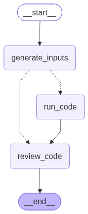

> `author:` Stefanos Panteli<br>
> `date:` 2026-07-24<br>
> `description:` The Code Tester agent generates runtime inputs for a Python function, executes the proposed implementation inside isolated Docker containers, and reviews the implementation together with the execution results before it is returned to the Software Engineer.

<br>

# **Table of contents**

   🗂️ [**Folder Structure**](#folder-structure)<br>
   ✅ [**Purpose**](#purpose)<br>
   🧠 [**Modes of operation**](#modes-of-operation)<br>
   ▶️ [**Entry point**](#entry-point)<br>
   📥📤 [**Interface**](#interface)<br>
       📥 [Input](#input)<br>
       📤 [Output](#output)<br>
   🧰 [**Tools and Structured Output**](#tools-and-structured-output)<br>
       🛠️ [Tools](#tools)<br>
       🧾 [Structured Output](#structured-output)<br>
   📌 [**Behaviour rules**](#behavior-rules)<br>
   🧭 [**Graph structure**](#graph-structure)<br>
       🧩 [Nodes](#nodes)<br>
       🔀 [Edges](#edges)<br>
       🌟 [Graph visualised](#graph-visualised)<br>
   🚀 [**Quickstart**](#quickstart)<br>

<br>

# **Folder Structure**

```python
	codeTester/
	├── graphs/
	│	└── code_tester_app.png       # The graph visualised.
	├── code_tester.py                # The LangGraph implementation of the agent.
	├── isolated_execution.py         # The isolated Docker execution environment.
	├── Dockerfile.code-tester        # Builds the Docker image used for function execution.
	├── prompts.py                    # The prompts used to power the agent.
	└── readme.md                     # This file.
```

<br><br>

# **Purpose**

This agent evaluates the latest implementation of a single Python function before it is accepted by the Software Engineer.

It performs three main operations:

1. Generates meaningful JSON-compatible keyword-argument inputs for the target function.
2. Executes the implementation once for every generated input inside a separate isolated Docker container.
3. Reviews the implementation together with the outputs, exceptions, tracebacks, and execution information.

It does this through a controlled flow:

* read the original Python file
* analyse the target function and implementation
* generate between 3 and 6 meaningful inputs when applicable
* execute each input independently in Docker
* collect completed and failed execution results
* review the implementation statically and dynamically
* return approval or comments for another Coder revision

This matters because the previous Coder review depended mainly on static analysis. The Code Tester adds direct execution evidence while keeping the generated code isolated from the host environment.

<br>

# **Modes of operation**

The agent supports two execution paths based on the generated inputs:

* Inputs generated:

  * the implementation is executed once for every generated keyword-argument dictionary
  * each input runs in a separate Docker container
  * the execution report is passed to the Reviewer

* No inputs generated:

  * isolated execution is skipped
  * the implementation is sent directly to the Reviewer for static analysis

A function that accepts no arguments is represented using:

```python
[{}]
```

This causes one isolated execution using:

```python
target_function()
```

An empty list means that no valid JSON-compatible input could be generated.

<br>

# **Entry point**

* App: `code_tester_app`
* Module: `agents/codeTester/code_tester.py`

<br>

# **Interface**

## Input

### CodeTesterInput (Pydantic)

* `function_name: str`: The exact name of the function to test.
* `file_path: str`: The path to the Python file containing the original source code and surrounding context.
* `implementation: str`: The latest implementation of the target function returned by the Coder.
* `imports: Optional[List[str]]`: Additional import statements required by the proposed implementation.
* `se_instructions: str`: The instructions originally given to the Coder by the Software Engineer.

## Intermediate Schema

### CodeTesterIntermediate (Pydantic)

* `function_name: str`: The exact name of the function under review.
* `file_path: str`: The path to the original Python source file.
* `implementation: str`: The latest implementation returned by the Coder.
* `imports: Optional[List[str]]`: Additional imports returned by the Coder.
* `se_instructions: str`: The Software Engineer instructions.
* `function_inputs: Optional[FunctionInputs]`: The generated keyword-argument inputs.
* `function_execution_report: Optional[CodeExecutionReport]`: The combined execution results.
* `execution_error: Optional[str]`: An infrastructure or execution-environment error that prevented the report from being created.

## Output

### CodeTesterOutput (Pydantic)

* `reviewer_comments: str`: Returns `yes` when no material implementation issue requires another Coder revision. Otherwise, returns a numbered list describing the identified issues and required corrections.

<br>

# **Tools and Structured Output**

## Tools

No LLM tools are used directly by the Code Tester agent.

The implementation is executed using the local `run_in_isolated_env` function from `isolated_execution.py`.

The isolated execution environment:

* uses the `thesis-code-tester` Docker image
* disables network access
* runs as an unprivileged user
* removes Linux capabilities
* prevents privilege escalation
* uses a read-only container filesystem
* applies memory, CPU, swap, and process limits
* mounts the project `utils` and `agents` directories as read-only
* gives each generated input a separate Docker container
* forcefully removes containers that exceed the execution timeout

## Structured Output

The Input Generator uses:

```python
.with_structured_output(FunctionInputs)
```

### FunctionInputs

* `kwargs: List[Dict[str, Any]]`: A list of function inputs in keyword-argument format.

Each dictionary represents one isolated execution and is passed as:

```python
target_function(**kwargs)
```

### FunctionExecutionResult

Stores the result of one isolated execution:

* `kwargs: Dict[str, Any]`
* `completed: bool`
* `output: Optional[Any]`
* `output_type: Optional[str]`
* `error_type: Optional[str]`
* `error_message: Optional[str]`
* `traceback: Optional[str]`
* `execution_time_seconds: Optional[float]`

### CodeExecutionReport

Combines all execution results:

* `function_name: str`
* `total_inputs: int`
* `completed_executions: int`
* `failed_executions: int`
* `results: List[FunctionExecutionResult]`

<br>

# **Behaviour rules**

* Input generation:

  * analyses the original source file, implementation, imports, function signature, docstring, and Software Engineer instructions
  * generates inputs only for the specified target function
  * uses the exact parameter names from the function signature
  * generates only JSON-compatible values
  * normally generates between 3 and 6 meaningful inputs
  * includes normal, empty, boundary, minimum, and alternative valid cases when applicable
  * returns `[{}]` for a function that accepts no arguments
  * returns an empty list only when no valid input can reasonably be generated

* Candidate code construction:

  * extracts top-level imports from the original source file
  * merges them with the additional imports returned by the Coder
  * removes duplicate imports
  * places `from __future__ import ...` statements first
  * combines the merged imports with the latest implementation

* Isolated execution:

  * checks that Docker is installed and available
  * verifies that the required Docker image exists
  * validates the local `utils` and `agents` directories
  * executes every generated input in a separate container
  * invokes ordinary Python functions using `target_function(**kwargs)`
  * invokes LangChain tools using their `.invoke(kwargs)` method
  * supports asynchronous return values
  * redirects candidate standard output and standard error so printed content cannot corrupt the JSON result
  * converts common outputs into JSON-compatible values
  * returns exceptions, tracebacks, and execution durations
  * continues with later inputs when one execution fails or times out

* Review:

  * compares the implementation with the original codebase and Software Engineer instructions
  * checks syntax, logic, state access, return values, LangGraph compatibility, security, and error handling
  * analyses every execution output, exception, traceback, and output type
  * distinguishes implementation defects from invalid inputs, missing dependencies, unavailable module-level context, Docker failures, and isolated-environment limitations
  * returns `yes` when no material implementation issue requires revision
  * otherwise returns no more than 5 material issues

<br>

# **Graph structure**

## Nodes

1. **`generate_inputs`**

   * Reads the original Python file using `read_state_file`.
   * Builds `GENERATE_INPUTS_PROMPT` using:

     * target function name
     * original source code
     * additional imports
     * latest implementation
     * Software Engineer instructions
   * Calls the Input Generator using structured output.
   * Stores the generated inputs in `function_inputs`.
   * If input generation fails, stores no inputs and proceeds to static review.

2. **`run_code`**

   * Runs only when at least one input dictionary was generated.
   * Builds the candidate code from:

     * original source imports
     * additional Coder imports
     * latest function implementation
   * Calls `run_in_isolated_env`.
   * Executes every generated input in a separate Docker container.
   * Parses the returned dictionary into `CodeExecutionReport`.
   * Stores infrastructure-level errors in `execution_error`.

3. **`review_code`**

   * Builds `REVIEW_PROMPT` using:

     * target function name
     * original source code
     * additional imports
     * latest implementation
     * Software Engineer instructions
     * isolated execution report
   * Calls the Reviewer LLM.
   * Returns `CodeTesterOutput` containing `reviewer_comments`.
   * If the Reviewer fails and an execution report exists, returns the execution report as the comments.
   * Otherwise, returns an empty string.

## Edges

* *START* → **`generate_inputs`**
* **`generate_inputs`** → *conditional* ⇢

  1. **`run_code`**: if at least one generated input exists
  2. **`review_code`**: if no generated inputs exist
* **`run_code`** → **`review_code`**
* **`review_code`** → *END*

## Graph visualised

<div align="center">
	
</div>

<br>

# **Quickstart**

```python
from agents.codeTester.code_tester import code_tester_app

graph_input = {
    'function_name': 'split_prompt',
    'file_path': r'C:\UCY\EPL-thesis\EPL-thesis\Clone\agents\promptEngineer\prompt_engineer.py',
    'implementation': '''
def split_prompt(content: str) -> Tuple[str, str, List[Tuple[str, str]]]:
    thinking_process, other = content.split('#> Prompt\\n')
    prompt, changes = other.split('#> Code Changes\\n')

    if '### old code' not in clean_llm_output(changes.lower()):
        changes = ''

    if changes:
        changes = [c for c in changes.split('## Change') if c]
        changes = [
            (
                c.split('### Old Code\\n')[1].split('### New Code\\n')[0],
                c.split('### New Code\\n')[1]
            )
            for c in changes
        ]

    return (
        clean_llm_output(thinking_process),
        clean_llm_output(prompt),
        [
            (clean_llm_output(old_code), clean_llm_output(new_code))
            for old_code, new_code in changes
            if old_code != new_code
        ] if changes else []
    )
''',
    'imports': [],
    'se_instructions': (
        'Implement split_prompt so it separates an LLM response into the thinking process, '
        'the proposed prompt, and a list of old-code/new-code change tuples. It must support '
        'responses with no code changes, clean every returned section using clean_llm_output, '
        'preserve the order of code changes, and exclude changes where the cleaned old and new '
        'code are identical.'
    )
}

response = code_tester_app.invoke(graph_input)

# approved response example:
# {
#	'reviewer_comments': 'yes'
# }

# response requiring another Coder revision:
# {
#	'reviewer_comments': '<numbered list of material issues and required corrections>'
# }
```
