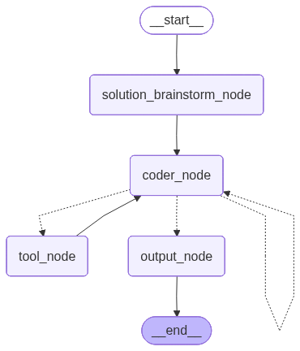

> `author:` Stefanos Panteli<br>
`date:` 2025-11-04<br>
`description:` The Coder agent implements a single function inside a target file. It can optionally propose helper functions and tools needed for the implementation. It is also used by the Software Engineer agent as a tool to generate candidate implementations during the engineering loop.

<br>

# **Table of contents**
&emsp;&emsp;&emsp;🗂️ [**Folder Structure**](#folder-structure)<br>
&emsp;&emsp;&emsp;✅ [**Purpose**](#purpose)<br>
&emsp;&emsp;&emsp;🔧 [**Used by Software Engineer**](#used-by-software-engineer)<br>
&emsp;&emsp;&emsp;▶️ [**Entry point**](#entry-point)<br>
&emsp;&emsp;&emsp;📥📤 [**Interface**](#interface)<br>
&emsp;&emsp;&emsp;&emsp;&emsp;&emsp;&emsp;📥 [Input](#input)<br>
&emsp;&emsp;&emsp;&emsp;&emsp;&emsp;&emsp;📤 [Output](#output)<br>
&emsp;&emsp;&emsp;🧰 [**Tools and Structured Output**](#tools-and-structured-output)<br>
&emsp;&emsp;&emsp;&emsp;&emsp;&emsp;&emsp;🛠️ [Tools](#tools)<br>
&emsp;&emsp;&emsp;&emsp;&emsp;&emsp;&emsp;🧾 [Structured Output](#structured-output)<br>
&emsp;&emsp;&emsp;📌 [**Behaviour rules**](#behavior-rules)<br>
&emsp;&emsp;&emsp;🧭 [**Graph structure**](#graph-structure)<br>
&emsp;&emsp;&emsp;&emsp;&emsp;&emsp;&emsp;🧩 [Nodes](#nodes)<br>
&emsp;&emsp;&emsp;&emsp;&emsp;&emsp;&emsp;🔀 [Edges](#edges)<br>
&emsp;&emsp;&emsp;&emsp;&emsp;&emsp;&emsp;🌟 [Graph visualised](#graph-visualised)<br>
&emsp;&emsp;&emsp;🚀 [**Quickstart**](#quickstart)<br>

<br>

# **Folder Structure**
```python
	coder/
	├── graphs/
	│	└── coder_app.png   # The graph visualised.
	├── coder.py		    # The langgraph implementation of the agent.
	├── prompts.py		    # The prompts used to power the agent.
	└── readme.md		    # This file.
```

<br><br>

# **Purpose**
This agent implements exactly one function in a target file.
It runs an internal loop that:
1. Brainstorms 2 to 3 solution approaches.
2. Generates a concrete single-function implementation.
3. Optionally uses one web-search tool for quick reference.
4. Submits the final code through a dedicated output tool.
5. Reviews the submitted code and either accepts it or re-runs coding with reviewer feedback.

The agent can also return:
- Function proposals (helper functions or tools) that would make the implementation safer or cleaner.
- Import lines needed by the implementation (never inline imports inside the submitted code).

<br>

# **Used by Software Engineer**
The Software Engineer agent can invoke this Coder agent as a tool inside its own workflow to generate candidate implementations for a requested function.
In that setup:
- The Software Engineer supplies `file_path`, `function_name`, and `software_engineer_instructions`.
- Prior attempts and comments through `previous_outputs` and `comments` are passed through the coder's memory component.

This matters because it keeps responsibilities clean:
- Software Engineer decides what should be built and validates direction.
- Coder produces the single-function patch and supports iteration.

<br>

# **Entry point**
- App: `coder_app`
- Module: `agents/coder/coder.py`

<br>

# **Interface**
## Input
### InputSchema (MessagesState)
- `file_path: str` Path of the file that contains the function to implement.
- `function_name: str` Name of the function to implement.
- `software_engineer_instructions: str` Primary instructions that constrain the implementation.
- `previous_outputs: List[OutputSchema]` Accumulated prior outputs for retry loops (filled by the coder's memory).
- `comments: List[str]` Accumulated comments from the Software Engineer for retry loops (prior comments remembered by the coder's memory).
- `previous_implementation: Optional[OutputSchema]` Last implementation submitted, used to continue iteration and provide feedback reviews by a reviewer LLM.
- `reviewer_comments: Optional[str]` Reviewer feedback from the previous attempt (previous_implementation).

> *Note*: Because InputSchema extends MessagesState, it also includes `messages`, used to carry tool results and model responses across nodes.

## Output
### OutputSchema (Pydantic)
- `code: str` The final implemented code for the single function only.
- `proposals: Optional[List[FunctionProposal]]` Optional helper function or tool proposals.
- `imports: Optional[List[str]]` Optional required imports as plain import lines.

<br>

# **Tools and Structured Output**
## Tools
The coder LLM is allowed to call:
- `tavily_search`: optional one-time web search to fetch examples or references.
- `output_tool`: required to submit final code, proposals, and imports.

> *Note*: `output_tool` is treated as terminal in practice because it produces the final OutputSchema payload that the workflow returns.

## Structured Output
### OutputSchema (Pydantic)
- `code: str`
- `proposals: Optional[List[FunctionProposal]]`
    - `function_type: Literal["helper_function", "tool"]`
    - `function_name: str`
    - `docstring: str`
    - `function_arguments: List[Argument]`
        - `name: str`
        - `type: str`
    - `output: str`
    - `justification: str`
- `imports: Optional[List[str]]`

<br>

# **Behaviour rules**
- Implements only the requested function and nothing else.
- Avoids inline imports inside `code`.
	- Any needed imports go in `imports`.
- Can use `tavily_search` at most once per implementation attempt.
- Uses `output_tool` to submit the final payload.
- Removes inline-import lines from `code` if the LLM accidentally included them, when the same import line appears in `imports`.
- Runs a reviewer step after submission:
	- If the reviewer outputs an empty string, the implementation is accepted.
	- Otherwise, reviewer feedback is fed back into the coder for another attempt.

<br>

# **Graph structure**
## Nodes
1. **`solution_brainstorm_node`**
	- Clears previous messages to avoid stale tool history.
	- Uses `SOLUTION_BRAINSTORM_PROMPT` to generate 2 to 3 solution approaches.
	- Appends the brainstorm output as an AI message.

2. **`coder_node`**
	- Builds `CODE_PROMPT` using:
		- full code snapshot
		- function name
		- software engineer instructions
		- prior outputs and comments
		- tool history
		- previous implementation and reviewer feedback (if present)
	- Calls the coder LLM, which may:
		- respond in natural language
		- call `tavily_search`
		- call `output_tool`

3. **`tool_node`**
	- Executes non-terminal tool calls (currently `tavily_search` only).
	- Appends ToolMessage results back to `messages` for the next `coder_node` run.

4. **`parse_output_tool`**
	- Extracts the tool call payload for `output_tool` from the last model message.
	- Ensures `proposals` and `imports` keys exist (defaults to empty lists if missing).
	- Invokes `output_tool` and stores the resulting OutputSchema in `previous_implementation`.

5. **`review_node`**
	- Reviews `previous_implementation.code` using `REVIEW_PROMPT`.
	- Writes review output to `reviewer_comments`.

6. **`output_node`**
	- Returns `previous_implementation` as the final OutputSchema.

## Edges
- *START* → **`solution_brainstorm_node`**
- **`solution_brainstorm_node`** → **`coder_node`**
- **`coder_node`** → *conditional* ⇢ 
    1. **`tool_node`**: tool called
    2. **`parse_output_tool`**: *output_tool* called
    3. **`coder_node`**: natural language response
- **`tool_node`** → **`coder_node`**
- **`parse_output_tool`** → *conditional* ⇢
    1. **`review_node`** 
    2. **`output_node`**: if reviewer already reviewed, skip review node
- **`review_node`** → *conditional* ⇢ 
    1. **`output_node`**: reviewer accepts
    2. **`coder_node`**: reviewer rejects
- **`output_node`** → *END*

## Graph visualised
<div align="center">
	
</div>

<br>

# **Quickstart**
```python
from agents.coder.coder import coder_app

graph_input = {
    "messages": [],
    "file_path": "./path/to/file.py",
    "function_name": "<function_name>",
    "software_engineer_instructions": "<software_engineer_instructions>",
    "previous_outputs": [],
    "comments": [],
    "previous_implementation": None,
    "reviewer_comments": None
}

response = coder_app.invoke(graph_input)

# response example:
# {
#	"code": "<implemented code for the single function>",
#	"proposals": [<possible helper function/tool proposals>, ...],
#	"imports": [<possible required imports>, ...]
# }
```
