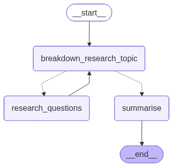

> `author:` Stefanos Panteli<br>
`date:` 2025-09-10<br>
`description:` The Deep Researcher agent breaks a research topic into a small set of focused sub-questions, runs parallel web research through the Researcher agent, and returns a single consolidated answer.

<br>

# **Table of contents**
&emsp;&emsp;&emsp;🗂️ [**Folder Structure**](#folder-structure)<br>
&emsp;&emsp;&emsp;✅ [**Purpose**](#purpose)<br>
&emsp;&emsp;&emsp;🧑‍🔬 [**Uses Researcher agent**](#uses-researcher-agent)<br>
&emsp;&emsp;&emsp;▶️ [**Entry point**](#entry-point)<br>
&emsp;&emsp;&emsp;📥📤 [**Interface**](#interface)<br>
&emsp;&emsp;&emsp;&emsp;&emsp;&emsp;&emsp;📥 [Input](#input)<br>
&emsp;&emsp;&emsp;&emsp;&emsp;&emsp;&emsp;📤 [Output](#output)<br>
&emsp;&emsp;&emsp;🧰 [**Tools and Structured Output**](#tools-and-structured-output)<br>
&emsp;&emsp;&emsp;&emsp;&emsp;&emsp;&emsp;🛠️ [Tools](#tools)<br>
&emsp;&emsp;&emsp;&emsp;&emsp;&emsp;&emsp;🧾 [Structured Output](#structured-output)<br>
&emsp;&emsp;&emsp;📌 [**Behaviour rules**](#behavior-rules)<br>
&emsp;&emsp;&emsp;🧭 [**Graph structure**](#graph-structure)<br>
&emsp;&emsp;&emsp;&emsp;&emsp;&emsp;&emsp;🧩 [Nodes](#nodes)<br>
&emsp;&emsp;&emsp;&emsp;&emsp;&emsp;&emsp;🔀 [Edges](#edges)<br>
&emsp;&emsp;&emsp;&emsp;&emsp;&emsp;&emsp;🌟 [Graph visualised](#graph-visualised)<br>
&emsp;&emsp;&emsp;🚀 [**Quickstart**](#quickstart)<br>

<br>

# **Folder Structure**
```python
	deepResearcher/
	├── graphs/
	│	└── deep_researcher_app.png # The graph visualised.
	├── deepResearcher.py           # The langgraph implementation of the agent.
	├── prompts.py                  # The prompts used to power the agent.
	└── readme.md                   # This file.
```

<br><br>

# **Purpose**
This agent takes one research topic and returns one consolidated answer.
It works as a small pipeline:
1. Break the topic into up to 3 distinct, non-overlapping research questions.
2. Research each question by invoking the Researcher agent.
3. Run the research in parallel using threads.
4. Summarise all findings into one final paragraph.

This matters because it keeps the final output short while still covering key angles.
It also saves time by parallelising the research calls.

<br>

# **Uses Researcher agent**
Deep Researcher does not browse directly.
It delegates web research to the Researcher agent.
That keeps responsibilities clear:
- Deep Researcher plans, orchestrates, and summarises.
- Researcher executes the actual web research and returns a short summary per sub-question.

<br>

# **Entry point**
- App: `deep_researcher_app`
- Module: `agents/deepResearcher/deepResearcher.py`

<br>

# **Interface**
## Input
### InputSchema (TypedDict)
- `research_topic: str` Topic to research.
- `not_yet_researched_questions: Optional[List[str]]` Pending research questions (internal working field).
- `researched_questions_answers: Optional[List[QnA]]` Accumulated QnA results (internal working field).
    - `question: str`
    - `answer: str`
- `error_occurred: bool` Indicates a breakdown failure and triggers retry (internal working field).

> *Note*: In normal usage you only provide `research_topic`. The other fields are internal state.

## Output
### OutputSchema (Pydantic)
- `answer: str` Final consolidated answer.

<br>

# **Tools and Structured Output**
## Tools
No tools are used directly by this agent.

The agent invokes `researcher_app` within a node, not as a tool.

## Structured Output
### StructuredOutput (Pydantic)
Used by the planning LLM to enforce a predictable breakdown output:
- `questions_to_research: List[str]` A list of questions to be researched by the researcher agents.

<br>

# **Behaviour rules**
- Breaks the topic into at most 3 useful, distinct research questions.
- Avoids re-asking questions already answered in `researched_questions_answers`.
- Runs research in parallel with a max of 5 worker threads.
- Clears `not_yet_researched_questions` after each research pass.
- Stops adding more research after 5 total QnA items and summarises.
- If breakdown fails, sets `error_occurred` and retries breakdown.
- Always returns one final paragraph summary.
- If summarisation fails, falls back to concatenating the collected answers.

<br>

# **Graph structure**
## Nodes
1. **`breakdown_research_topic`**
	- Builds `BREAKDOWN_PROMPT` using:
		- `research_topic`
		- already-researched QnA (if any)
	- Calls `deep_researcher` LLM with structured output.
	- Writes results to `not_yet_researched_questions`.
	- Sets `error_occurred` when an exception happens.

2. **`research_questions`**
	- Runs each question in `not_yet_researched_questions` through `researcher_app`.
	- Uses `ThreadPoolExecutor` with up to 5 workers.
	- Collects responses into `QnA` objects:
		- `question` comes from the researcher response `research_topic`.
		- `answer` comes from the researcher response `summary`.
	- Appends results into `researched_questions_answers` and clears the pending list.

3. **`summarise`**
	- Builds `SUMMARY_PROMPT` with:
		- `research_topic`
		- stringified `researched_questions_answers`
	- Calls `summariser` LLM.
	- Returns `OutputSchema(answer= ...)`.

## Edges
- *START* → **`breakdown_research_topic`**
- **`breakdown_research_topic`** → *conditional* ⇢
	1. **`breakdown_research_topic`**: if `error_occurred` is true
	2. **`summarise`**: if no pending questions or limit reached
	3. **`research_questions`**: if there are pending questions
- **`research_questions`** → **`breakdown_research_topic`**
- **`summarise`** → *END*

## Graph visualised
<div align="center">
	
</div>

<br>

# **Quickstart**
```python
from agents.deepResearcher.deepResearcher import deep_researcher_app

graph_input = {
    "research_topic": "<topic_to_research>",
}

response = deep_researcher_app.invoke(graph_input)

# response example:
# {
#	"answer": "<single consolidated paragraph>"
# }
```
