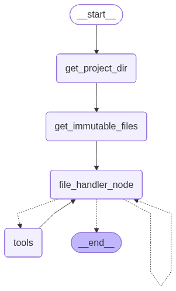

> `author:` Stefanos Panteli<br>
`date:` 2026-01-17<br>
`description:` The File Handler agent creates the missing non-Python project files and folders required for a generated agent to run. It uses tool calls to create directories, create files, read files, and safely modify files under a constrained project directory.

<br>

# **Table of contents**
&emsp;&emsp;&emsp;🗂️ [**Folder Structure**](#folder-structure)<br>
&emsp;&emsp;&emsp;✅ [**Purpose**](#purpose)<br>
&emsp;&emsp;&emsp;🔒 [**Safety and boundaries**](#safety-and-boundaries)<br>
&emsp;&emsp;&emsp;▶️ [**Entry point**](#entry-point)<br>
&emsp;&emsp;&emsp;📥📤 [**Interface**](#interface)<br>
&emsp;&emsp;&emsp;&emsp;&emsp;&emsp;&emsp;📥 [Input](#input)<br>
&emsp;&emsp;&emsp;&emsp;&emsp;&emsp;&emsp;📤 [Output](#output)<br>
&emsp;&emsp;&emsp;🧰 [**Tools and Structured Output**](#tools-and-structured-output)<br>
&emsp;&emsp;&emsp;&emsp;&emsp;&emsp;&emsp;🛠️ [Tools](#tools)<br>
&emsp;&emsp;&emsp;&emsp;&emsp;&emsp;&emsp;🧾 [Structured Output](#structured-output)<br>
&emsp;&emsp;&emsp;📌 [**Behaviour rules**](#behavior-rules)<br>
&emsp;&emsp;&emsp;🧭 [**Graph structure**](#graph-structure)<br>
&emsp;&emsp;&emsp;&emsp;&emsp;&emsp;&emsp;🧩 [Nodes](#nodes)<br>
&emsp;&emsp;&emsp;&emsp;&emsp;&emsp;&emsp;🔀 [Edges](#edges)<br>
&emsp;&emsp;&emsp;&emsp;&emsp;&emsp;&emsp;🌟 [Graph visualised](#graph-visualised)<br>
&emsp;&emsp;&emsp;🚀 [**Quickstart**](#quickstart)<br>

<br>

# **Folder Structure**
```python
	fileHandler/
	├── graphs/
	│	└── file_handler_app.png    # The graph visualised.
	├── file_handler.py             # The langgraph implementation of the agent.
	├── prompts.py                  # The prompts used to power the agent.
	└── readme.md                   # This file.
```

<br><br>

# **Purpose**
This agent prepares a generated project so it can run successfully by creating the missing files and folders.
Its output value is not the goal.
The goal is the side effect of having the required structure and files present on disk.

Typical examples of what it creates:
- missing directories under a project folder
- missing configuration files
- storage files
- environment template files (with placeholders, not real secrets)

<br>

# **Safety and boundaries**
This agent enforces strict boundaries so it cannot damage unrelated files:
- It defines a global `project_dir` derived from the provided `file_path` parent directory.
- All tool operations must resolve under `project_dir`.
- It records existing files at startup into `immutable_files`.
- It refuses to modify any file that existed before the agent started.

This matters because the agent can run with write access.
The boundary rules reduce the risk of accidental edits outside the target project.

<br>

# **Entry point**
- App: `file_handler_app`
- Module: `agents/fileHandler/file_handler.py`

<br>

# **Interface**
## Input
### InputSchema (MessagesState)
- `file_path: str` Path to the main code file for the generated agent.

> *Note*: Because InputSchema extends MessagesState, it also includes `messages`, which the agent uses for the approval loop.

## Output
The graph does not define a dedicated output schema.
The returned state is not important.
The practical output is the filesystem side effect: directories and files created under `project_dir`.

<br>

# **Tools and Structured Output**
## Tools
The file handler LLM is allowed to call:
- `create_directory(directory_path: str) -> str`<br>
This tool creates the directory with path `directory_path` under `project_dir`.
- `create_file(file_path: str, contents: str) -> str`<br>
This tool creates the file with path `file_path` under `project_dir` with contents `contents`.
- `modify_file(file_path: str, file_changes: List[Tuple[str, str]]) -> str`<br>
This tool modifies the file with path `file_path` under `project_dir` by replacing the old lines with the new lines contained within `file_changes`.
- `read_file(file_path: str) -> str`<br>
This tool reads the file with path `file_path` under `project_dir` and returns its contents.

All tools must operate under `project_dir`.
Tool responses are returned as strings and appended into `messages` as ToolMessage objects via the ToolNode.

## Structured Output
No structured output is enforced for the LLM.

<br>

# **Behaviour rules**
- Determines `project_dir` as `Path(state["file_path"]).parent.resolve()`.
- Captures all existing files under `project_dir` into `immutable_files`.
- Builds a prompt that includes:
	- code snapshot from `read_state_file(state)`
	- the prompts file contents located next to the code file
	- a formatted directory tree of sibling files
- Calls the tool-bound LLM and loops until completion.
- Ends the workflow only when the model responds with a non-tool message whose content is empty.

File content rules enforced by the prompt:
- Do not insert dummy data into storage files.
- Use placeholders like `[PLACEHOLDER_NAME]` when needed.
- For hidden or secret files, create structure but use placeholder content like `[*_HERE]`.

<br>

# **Graph structure**
## Nodes
1. **`get_project_dir`**
	- Sets the global `project_dir` from the input `file_path`.
	- Returns the state unchanged.

2. **`get_immutable_files`**
	- Recursively scans `project_dir` and stores file paths into global `immutable_files`.
	- This list is used by tools to block modifications to pre-existing files.

3. **`file_handler_node`**
	- Loads the sibling prompts file (`*_prompts.py`) and injects it into `FILE_HANDLER_PROMPT`.
	- Injects a sibling file tree view using `read_sibling_files(file_path)`.
	- Calls the tool-enabled LLM.
	- Writes the LLM response back into state `messages`.

4. **`tools`**
	- A ToolNode that executes any pending tool calls from the LLM.
	- Appends ToolMessage results back to `messages` for the next loop.

## Edges
- *START* → **`get_project_dir`**
- **`get_project_dir`** → **`get_immutable_files`**
- **`get_immutable_files`** → **`file_handler_node`**
- **`file_handler_node`** → *conditional* ⇢
	1. **`tools`**: if the last message is a tool call
	2. **`file_handler_node`**: if the last message is non-empty text
	3. *END*: if the last message is empty text and no tool call
- **`tools`** → **`file_handler_node`**

## Graph visualised
<div align="center">
	
</div>

<br>

# **Quickstart**
```python
from agents.fileHandler.file_handler import file_handler_app

graph_input = {
    "file_path": "./path/to/generated_agent.py",
    "messages": []
}

response = file_handler_app.invoke(graph_input)

# response: state dict
# main outcome: files and folders created under the project directory
```
