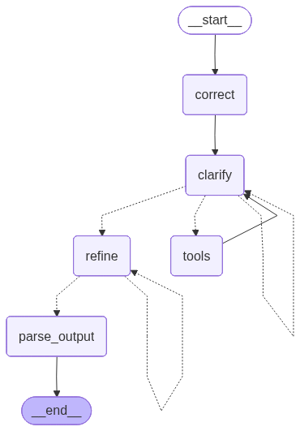

> `author:` Stefanos Panteli<br>
`date:` 2025-08-06<br>
`description:` The Input Refiner agent takes raw user input and produces a corrected version plus a refined, agent-creation-ready request. It can run an interactive clarification loop, optionally delegating clarifying QnA to the Clarification Orchestrator, and it may use a single web-search tool to fill missing context.

<br>

# **Table of contents**
&emsp;&emsp;&emsp;🗂️ [**Folder Structure**](#folder-structure)<br>
&emsp;&emsp;&emsp;✅ [**Purpose**](#purpose)<br>
&emsp;&emsp;&emsp;🧠 [**Modes of operation**](#modes-of-operation)<br>
&emsp;&emsp;&emsp;▶️ [**Entry point**](#entry-point)<br>
&emsp;&emsp;&emsp;📥📤 [**Interface**](#interface)<br>
&emsp;&emsp;&emsp;&emsp;&emsp;&emsp;&emsp;📥 [Input](#input)<br>
&emsp;&emsp;&emsp;&emsp;&emsp;&emsp;&emsp;📤 [Output](#output)<br>
&emsp;&emsp;&emsp;🧰 [**Tools and Structured Output**](#tools-and-structured-output)<br>
&emsp;&emsp;&emsp;&emsp;&emsp;&emsp;&emsp;🛠️ [Tools](#tools)<br>
&emsp;&emsp;&emsp;&emsp;&emsp;&emsp;&emsp;🧾 [Structured Output](#structured-output)<br>
&emsp;&emsp;&emsp;📌 [**Behaviour rules**](#behavior-rules)<br>
&emsp;&emsp;&emsp;🧭 [**Graph structure**](#graph-structure)<br>
&emsp;&emsp;&emsp;&emsp;&emsp;&emsp;&emsp;🧩 [Nodes](#nodes)<br>
&emsp;&emsp;&emsp;&emsp;&emsp;&emsp;&emsp;🔀 [Edges](#edges)<br>
&emsp;&emsp;&emsp;&emsp;&emsp;&emsp;&emsp;🌟 [Graph visualised](#graph-visualised)<br>
&emsp;&emsp;&emsp;🚀 [**Quickstart**](#quickstart)<br>

<br>

# **Folder Structure**
```python
	inputRefiner/
	├── graphs/
	│	└── input_refiner_app.png   # The graph visualised.
	├── input_refiner.py            # The langgraph implementation of the agent.
	├── prompts.py                  # The prompts used to power the agent.
	└── readme.md                   # This file.
```

<br><br>

# **Purpose**
This agent converts an unstructured user request into two outputs:
1. A corrected version of the original request, fixing grammar and spelling while keeping vocabulary and meaning stable.
2. A refined version that is precise and ready for downstream agent creation.

It does this through a controlled loop:
- correct the input
- clarify missing details using questions or assumptions
- optionally use a single web search to fill critical gaps
- refine into an agent-creation-ready paragraph plus an essentials checklist
- ask for user approval and iterate until accepted

This matters because downstream agents depend on the refined request being complete and unambiguous.

<br>

# **Modes of operation**
The agent supports two clarification modes based on `orchestrator`:
- `orchestrator = False`: asks the user directly for clarification inside the loop.
- `orchestrator = True`: delegates each clarification question to `clarification_orchestrator_app` and stores returned QnA.

Both modes produce the same OutputSchema in the end.

<br>

# **Entry point**
- App: `input_refiner_app`
- Module: `agents/inputRefiner/input_refiner.py`

<br>

# **Interface**
## Input
### InputSchema (TypedDict)
- `orchestrator: bool` If true, uses the Clarification Orchestrator to answer clarification questions.
- `user_input: str` Raw user input to be corrected, clarified, and refined.

## Intermediate Schema
### IntermediateSchema (MessagesState)
- `qna: List[Tuple[str, str]]`: clarification questions and answers
- `refinements`: prior refinement attempts
- `user_requests`: user approvals or change requests for refinements

> *Note*: Because this schema extends MessagesState, it also includes `messages`, which the agent uses for the approval loop.

## Output
### OutputSchema (Pydantic)
- `corrected_original: str` The original request with grammar and spelling fixed, vocabulary unchanged.
- `refined_text: str` A precise, clear, agent-creation-ready request in natural language.

<br>

# **Tools and Structured Output**
## Tools
The Clarifier LLM may call:
- `tavily_search(query: str) -> str`<br>
Optional web search used to gather context when the user request is vague or missing critical facts.

The tool is executed through a ToolNode and its ToolMessage output is appended to `messages` for the next clarification step.

## Structured Output
No structured output for any LLM.

<br>

# **Behaviour rules**
- Correct step:
	- fixes grammar and spelling
	- keeps vocabulary and meaning stable
	- strips wrapping quotes and backticks from the corrected text
- Clarification step:
	- asks for a clarification or makes an assumption at a time
	- avoids repeating the same question endlessly by using QnA history
	- can trigger a single web search when needed
	- can delegate QnA collection to the orchestrator when enabled
- Refinement step:
	- produces a refined paragraph plus an essentials bullet list
	- asks the user for approval
	- if rejected, stores the user request and refines again
- Finish:
	- returns OutputSchema using the last refinement attempt

<br>

# **Graph structure**
## Nodes
1. **`correct`**
	- Uses CORRECTION_PROMPT to correct the user input.
	- Stores the corrected result into `corrected_original`.
	- Initializes state:
		- `messages`: one HumanMessage containing the corrected text
		- `qna`: empty list
		- `refinements`: empty list
		- `user_requests`: empty list

2. **`clarify`**
	- Uses CLARIFICATION_PROMPT with:
		- corrected original
		- prior tool call results (if any)
		- clarification history (QnA)
	- Calls the clarifier LLM and then:
		- if it indicates no clarification needed, stores an AIMessage and exits the clarification loop
		- if it triggers a tool call, returns the tool-call message so ToolNode can execute
		- otherwise asks for a user answer directly or via orchestrator and appends to `qna`

3. **`tools`**
	- Executes the Tavily tool call when requested by the clarifier.
	- Appends ToolMessage output to `messages`.

4. **`refine`**
	- Builds REFINE_INPUT_PROMPT using conversation history and any refinement user requests.
	- Calls the refiner LLM to generate a refined agent-creation-ready output.
	- Asks the user for approval:
		- if approved, proceeds to parse_output
		- if not approved, stores the request and repeats

5. **`parse_output`**
	- Builds OutputSchema using:
		- `corrected_original`
		- last refinement content as `refined_text`

## Edges
- *START* → **`correct`**
- **`correct`** → **`clarify`**
- **`clarify`** → *conditional* ⇢
	1. **`tools`**: if a tool call is required
	2. **`refine`**: if no clarification needed
	3. **`clarify`**: otherwise keep clarifying
- **`tools`** → **`clarify`**
- **`refine`** → *conditional* ⇢
	1. **`parse_output`**: if user approves
	2. **`refine`**: if user requests changes
- **`parse_output`** → *END*

## Graph visualised
<div align="center">
	
</div>

<br>

# **Quickstart**
```python
from agents.inputRefiner.input_refiner import input_refiner_app

graph_input = {
    "orchestrator": False,
    "user_input": "<user input>"
}

response = input_refiner_app.invoke(graph_input)

# response example:
# {
#	"corrected_original": "<corrected user input>",
#	"refined_text": "<refined paragraph + essentials bullet list>"
# }
```
