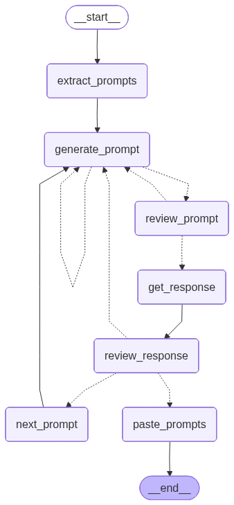

> `author:` Stefanos Panteli<br>
`date:` 2025-12-24<br>
`description:` The Prompt Engineer agent generates and iterates on prompt templates required by a target Python file. It discovers which prompt constants are used from the `prompts` module, generates each prompt, reviews it, tests it with realistic formatting inputs, reviews the produced response, and finally writes the approved prompts to the sibling `*_prompts.py` file while applying minimal formatting-related code changes.

<br>

# **Table of contents**
&emsp;&emsp;&emsp;🗂️ [**Folder Structure**](#folder-structure)<br>
&emsp;&emsp;&emsp;✅ [**Purpose**](#purpose)<br>
&emsp;&emsp;&emsp;🧑‍⚖️ [**Review flow**](#review-flow)<br>
&emsp;&emsp;&emsp;▶️ [**Entry point**](#entry-point)<br>
&emsp;&emsp;&emsp;📥📤 [**Interface**](#interface)<br>
&emsp;&emsp;&emsp;&emsp;&emsp;&emsp;&emsp;📥 [Input](#input)<br>
&emsp;&emsp;&emsp;&emsp;&emsp;&emsp;&emsp;📤 [Output](#output)<br>
&emsp;&emsp;&emsp;🧰 [**Tools and Structured Output**](#tools-and-structured-output)<br>
&emsp;&emsp;&emsp;&emsp;&emsp;&emsp;&emsp;🛠️ [Tools](#tools)<br>
&emsp;&emsp;&emsp;&emsp;&emsp;&emsp;&emsp;🧾 [Structured Output](#structured-output)<br>
&emsp;&emsp;&emsp;📌 [**Behaviour rules**](#behavior-rules)<br>
&emsp;&emsp;&emsp;🧭 [**Graph structure**](#graph-structure)<br>
&emsp;&emsp;&emsp;&emsp;&emsp;&emsp;&emsp;🧩 [Nodes](#nodes)<br>
&emsp;&emsp;&emsp;&emsp;&emsp;&emsp;&emsp;🔀 [Edges](#edges)<br>
&emsp;&emsp;&emsp;&emsp;&emsp;&emsp;&emsp;🌟 [Graph visualised](#graph-visualised)<br>
&emsp;&emsp;&emsp;🚀 [**Quickstart**](#quickstart)<br>

<br>

# **Folder Structure**
```python
	promptEngineer/
	├── graphs/
	│	└── prompt_engineer_app.png # The graph visualised.
	├── prompt_engineer.py          # The langgraph implementation of the agent.
	├── prompts.py                  # The meta-prompts used to generate/review/test prompts.
	└── readme.md                   # This file.
```

<br><br>

# **Purpose**
This agent creates prompt templates for LLM nodes that depend on `prompts.<NAME>` constants inside a target file.

It runs a strict loop per prompt name:
1. Extract prompt names referenced as `prompts.<PROMPT_NAME>` in the code.
2. Generate the missing prompt template for the active prompt name.
3. Review the prompt to catch prompt weaknesses.
4. Produce a realistic formatting dictionary that satisfies all `.format` placeholders.
5. Test the prompt by invoking a tester LLM with the formatted prompt.
6. Review the tester response to catch prompt weaknesses.
7. Iterate until approved.
8. Paste all approved prompts into the sibling `*_prompts.py` file and apply minimal `.format`-related code changes.

This matters because broken prompt templates often fail at runtime due to missing placeholders, brace issues, or mismatched tool and output expectations. This agent aims to make prompts reliable and directly runnable.

<br>

# **Review flow**
The agent supports three modes via `mode`:
- `llm`: only the expert reviewer LLM reviews prompts and responses.
- `user`: only the user reviews prompts and responses.
- `both`: both the expert reviewer and the user review prompts and responses.

Review limits:
- Prompt review: up to 2 expert review passes per prompt.
- Response review: up to 3 expert review passes per prompt.

<br>

# **Entry point**
- App: `prompt_engineer_app`
- Module: `agents/promptEngineer/prompt_engineer.py`

<br>

# **Interface**
## Input
### InputSchema (TypedDict)
- `file_path: str` Path of the Python file whose referenced prompts should be generated.
- `prompt_list: Optional[List[Prompt]]` Should be `None` at start. Used internally after extraction.
- `active_prompt_index: Optional[int]` Should be `None` at start. Used internally to select the active prompt.
- `error: Optional[bool]` Should be `None` at start. Used internally for retrying generation on failures.
- `mode: Literal['llm', 'user', 'both']` Determines who reviews prompts and responses.

## Output
### Output (InputSchema-like dict)
The output is the same state dict shape and is not intended as a stable API surface.
The main side effects are:
- writing the generated prompt templates into the sibling `*_prompts.py` file
- applying minimal formatting-related code changes into the target `file_path`

Returned keys typically include:
- `file_path`
- `prompt_list`
- `active_prompt_index`
- `error`
- `mode`

<br>

# **Tools and Structured Output**
## Tools
This agent does not use tool calling. It operates through standard LLM invocations and file writes in the final node.

## Structured Output
The agent uses structured output once:
- `Format` (Pydantic), produced by `formater.with_structured_output(Format)`
	- `format_dict: Dict` Values to fill the prompt template via `prompt.format(**format_dict)`
	- `non_format_messages_list: List[BaseMessage]` Messages that must be passed to the model invocation instead of formatting into the prompt

The internal prompt tracking structure is:
- `Prompt` (Pydantic)
	- `prompt_name: str`
	- `suggested_prompt: str`
	- `necessary_code_changes: List[Tuple[str, str]]`
	- `format: Format`
	- `user_comments: List[str]`
	- `latest_response: str`
	- `prompt_reviews: int`
	- `response_reviews: int`

<br>

# **Behaviour rules**
- Extracts prompt names by scanning assignments that reference `prompts.<NAME>`.
- Generates prompts using a strict response format and splits output into:
	- thinking process
	- prompt template
	- minimal code changes for formatting reliability
- Enforces `.format` safety:
	- placeholders must use `{name}` inside generated prompt templates
	- literal braces must be escaped as `{{` and `}}`
- Supports iterative improvement:
	- aggregates only non-approving comments when regenerating
	- prioritizes the latest conflicting comment
- Testing is realistic:
	- generates formatting values that make sense for the codebase
	- optionally provides `non_format_messages_list` for message-driven prompts
- Only applies code edits that are safe under `code.replace(old, new)`:
	- adds missing `.format` inputs
	- adds minimal initialization code required to compute those inputs
	- avoids refactors and avoids unrelated logic changes
- Pastes all prompts at the end:
	- writes `PROMPT_NAME = """..."""` blocks into the sibling `*_prompts.py`
	- applies accumulated code changes to the target Python file

<br>

# **Graph structure**
## Nodes
1. **`extract_prompts`**
	- Reads the file at `file_path`.
	- Extracts prompt constant names referenced as `prompts.<NAME>`.
	- Initializes:
		- `prompt_list`: list of Prompt objects in first-seen order
		- `active_prompt_index`: 0
		- `error`: False

2. **`generate_prompt`**
	- Builds GENERATE_PROMPT_PROMPT using:
		- active prompt name
		- full code snapshot via `read_state_file`
	- Invokes `prompt_engineer`.
	- Parses the result into:
		- suggested prompt template
		- minimal code changes (old,new)
	- Stores them into the active Prompt object.
	- Sets `error` True on failure to enable retry.

3. **`review_prompt`**
	- Shows the latest suggested prompt.
	- If mode allows and review budget permits:
		- expert review using REVIEW_PROMPT_PROMPT
		- user review via interactive input
	- Stores comments into the active Prompt object.
	- Increments prompt review counter for expert reviews.

4. **`get_response`**
	- Generates formatting values using FORMAT_PROMPT and the `formater` model.
	- Formats the suggested prompt with `format_dict`.
	- Appends TESTER_PROMPT.
	- Invokes `tester` and stores the latest response in the active Prompt object.
	- Resets prompt review counter for the next cycle.

5. **`review_response`**
	- Shows the latest tester response.
	- If mode allows and review budget permits:
		- expert response review using REVIEW_RESPONSE_PROMPT
		- user review via interactive input
	- Stores comments into the active Prompt object.
	- Increments response review counter for expert reviews.

6. **`next_prompt`**
	- Increments `active_prompt_index` to move to the next Prompt.

7. **`paste_prompts`**
	- Writes all `prompt_list` items into the sibling `*_prompts.py` file:
		- `PROMPT_NAME = """ ... """`
	- Applies all `necessary_code_changes` into the target `file_path` via in-memory `replace`.
	- Writes the final updated code back to disk.

## Edges
- *START* → **`extract_prompts`**
- **`extract_prompts`** → **`generate_prompt`**
- **`generate_prompt`** → *conditional* ⇢
	1. **`generate_prompt`**: if `error` is True
	2. **`review_prompt`**: if generated successfully
- **`review_prompt`** → *conditional* ⇢
	1. **`generate_prompt`**: if prompt rejected
	2. **`get_response`**: if prompt approved
- **`get_response`** → **`review_response`**
- **`review_response`** → *conditional* ⇢
	1. **`generate_prompt`**: if response rejected
	2. **`next_prompt`**: if approved and prompts remain
	3. **`paste_prompts`**: if approved and no prompts remain
- **`next_prompt`** → **`generate_prompt`**
- **`paste_prompts`** → *END*

## Graph visualised
<div align="center">
	
</div>

<br>

# **Quickstart**
```python
from agents.promptEngineer.prompt_engineer import prompt_engineer_app

graph_input = {
    "file_path": "path/to/file.py",
    "mode": "both",
    "prompt_list": None,
    "active_prompt_index": None,
    "error": None
}

response = prompt_engineer_app.invoke(graph_input)

# response example (not used):
# {
#	"file_path": "...",
#	"prompt_list": [Prompt(...), ...],
#	"active_prompt_index": 3,
#	"error": False,
#	"mode": "both"
# }
```
