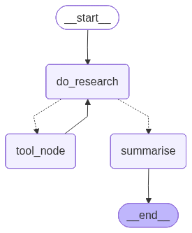

> `author:` Stefanos Panteli<br>
`date:` 2025-09-04<br>
`description:` The Researcher agent takes one research topic and gathers relevant information using web search and knowledge tools. It runs a tool-calling loop, stores structured research results, and outputs a single natural-language summary.

<br>

# **Table of contents**
&emsp;&emsp;&emsp;🗂️ [**Folder Structure**](#folder-structure)<br>
&emsp;&emsp;&emsp;✅ [**Purpose**](#purpose)<br>
&emsp;&emsp;&emsp;▶️ [**Entry point**](#entry-point)<br>
&emsp;&emsp;&emsp;📥📤 [**Interface**](#interface)<br>
&emsp;&emsp;&emsp;&emsp;&emsp;&emsp;&emsp;📥 [Input](#input)<br>
&emsp;&emsp;&emsp;&emsp;&emsp;&emsp;&emsp;📤 [Output](#output)<br>
&emsp;&emsp;&emsp;🧰 [**Tools and Structured Output**](#tools-and-structured-output)<br>
&emsp;&emsp;&emsp;&emsp;&emsp;&emsp;&emsp;🛠️ [Tools](#tools)<br>
&emsp;&emsp;&emsp;&emsp;&emsp;&emsp;&emsp;🧾 [Structured Output](#structured-output)<br>
&emsp;&emsp;&emsp;📌 [**Behaviour rules**](#behavior-rules)<br>
&emsp;&emsp;&emsp;🧭 [**Graph structure**](#graph-structure)<br>
&emsp;&emsp;&emsp;&emsp;&emsp;&emsp;&emsp;🧩 [Nodes](#nodes)<br>
&emsp;&emsp;&emsp;&emsp;&emsp;&emsp;&emsp;🔀 [Edges](#edges)<br>
&emsp;&emsp;&emsp;&emsp;&emsp;&emsp;&emsp;🌟 [Graph visualised](#graph-visualised)<br>
&emsp;&emsp;&emsp;🚀 [**Quickstart**](#quickstart)<br>

<br>

# **Folder Structure**
```python
	researcher/
	├── graphs/
	│	└── researcher_app.png  # The graph visualised.
	├── researcher.py           # The langgraph implementation of the agent.
	├── prompts.py              # The prompts used to power the agent.
	└── readme.md               # This file.
```

<br><br>

# **Purpose**
This agent answers a single research question by using web search and knowledge tools in a controlled loop.

It:
1. Receives a single `research_topic`.
2. Uses tool calls to search the web and extract relevant information.
3. Stores findings as structured `ResearchResult` objects.
4. Stops searching once it has enough evidence and composes a single natural-language summary.

This matters because downstream agents can reuse:
- the structured evidence in `results`
- and the concise final `summary`

<br>

# **Entry point**
- App: `researcher_app`
- Module: `agents/researcher/researcher.py`

<br>

# **Interface**
## Input
### InputSchema (MessagesState)
- `research_topic: str` The topic to research. Should be one topic and described in high detail.
- `results: Optional[List[ResearchResult]]` Accumulated research results. Start with `[]` or `None`.
- `error_occurred: bool` Internal flag to control retries.

> *Note*: Because InputSchema extends MessagesState, it also includes `messages`, which carries tool messages and model responses across nodes.

## Output
### OutputSchema (Pydantic)
- `research_topic: str` Same as input.
- `summary: str` A single natural-language paragraph summarizing the findings.

<br>

# **Tools and Structured Output**
## Tools
The researcher LLM is allowed to call:

1. `duckduckgo_search(query: str) -> str`<br>
Searches the web using DuckDuckGo and returns text results.

2. `wikipedia_search(...) -> str`<br>
Searches Wikipedia and returns relevant extracts.

3. `tavily_search(query: str) -> str`<br>
Searches the web using Tavily with advanced depth and returns results plus an included answer when available.

4. `ResearchResult(...) -> ResearchResult`<br>
A structured tool used to record the results of research.
   The agent should call this after each meaningful search.

5. `think_tool(reflection: str) -> str`<br>
A reflection tool used to assess what was found, what is missing, and whether to continue searching. The agent should call this after or at the same time as `ResearchResult`.

## Structured Output
### ResearchResult (Pydantic, used as a tool payload)
- `research_query: Union[str, List[str]]` The query or queries used.
- `url: List[Optional[str]]` URLs of documents used.
- `title: List[Optional[str]]` Titles of documents used.
- `date_created: List[Optional[str]]` Document dates.
- `author: List[Optional[str]]` Document authors.
- `relevant_information: str` A clear paragraph of extracted information.

### OutputSchema (Pydantic)
- `research_topic: str`
- `summary: str`

<br>

# **Behaviour rules**
- Research scope:
	- Research only what is directly related to `research_topic`.
	- Stop when you can answer confidently and avoid redundant searches.

- Tool discipline:
	- Use web search tools to gather sources and facts.
	- After each useful search, call `ResearchResult` to record extracted information.
	- After or alongside `ResearchResult`, call `think_tool` to decide next steps.

- Tool budgets:
	- Simple topics: 2 to 3 search tool calls.
	- Complex topics: up to 5 search tool calls.
	- If the last search is sufficient, stop immediately.

- Output discipline:
	- The final output is one paragraph only through the `summarise` node.
	- No bullet lists or extra sections in the final summary.

<br>

# **Graph structure**
## Nodes
1. **`do_research`**
	- Builds `RESEARCH_PROMPT` with:
		- today’s date string
		- `research_topic`
	- Invokes the `researcher` LLM with:
		- the system prompt
		- accumulated `messages` (tool history)
	- Expected outcomes:
		- LLM requests tool calls for search and extraction
		- or produces a final message without tool calls

2. **`tool_node`**
	- Reads tool calls from the last model message.
	- Executes each tool call and appends ToolMessage outputs to `messages`.
	- If a `ResearchResult` tool call is executed, appends it to `results` as structured evidence.

3. **`summarise`**
	- Formats `SUMMARY_PROMPT` with:
		- today’s date string
		- `research_topic`
		- all structured `results`
		- full tool conversation history
	- Invokes `summariser` and returns `OutputSchema`.

## Edges
- *START* → **`do_research`**
- **`do_research`** → *conditional* ⇢
	1. **`tool_node`**: if tool calls exist
	2. **`summarise`**: if no tool calls exist
	3. **`do_research`**: if `error_occurred` is True
- **`tool_node`** → **`do_research`**
- **`summarise`** → *END*

## Graph visualised
<div align="center">
	
</div>

<br>

# **Quickstart**
```python
from agents.researcher.researcher import researcher_app

graph_input = {
    "messages": [],
    "research_topic": "<topic_to_research>",
    "results": [],
    "error_occurred": False
}

response = researcher_app.invoke(graph_input)

# response example:
# {
#	"research_topic": "<topic_to_research>",
#	"summary": "<final_summary>"
# }
```
