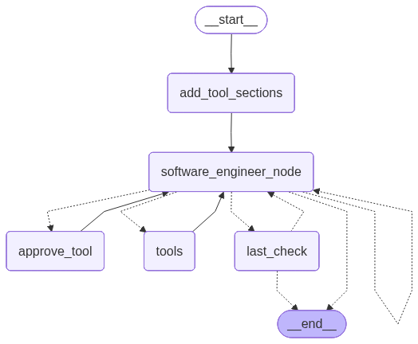

> `author:` Stefanos Panteli<br>
`date:` 2025-11-03<br>
`description:` The Software Engineer agent orchestrates coder subagents to implement an outlined Python file. It reviews coder outputs, applies approved code to the target file, manages imports, and runs a final QA pass to collect issues before completion.

<br>

# **Table of contents**
&emsp;&emsp;&emsp;🗂️ [**Folder Structure**](#folder-structure)<br>
&emsp;&emsp;&emsp;✅ [**Purpose**](#purpose)<br>
&emsp;&emsp;&emsp;▶️ [**Entry point**](#entry-point)<br>
&emsp;&emsp;&emsp;📥📤 [**Interface**](#interface)<br>
&emsp;&emsp;&emsp;&emsp;&emsp;&emsp;&emsp;📥 [Input](#input)<br>
&emsp;&emsp;&emsp;&emsp;&emsp;&emsp;&emsp;📤 [Output](#output)<br>
&emsp;&emsp;&emsp;🧰 [**Tools and Structured Output**](#tools-and-structured-output)<br>
&emsp;&emsp;&emsp;&emsp;&emsp;&emsp;&emsp;🛠️ [Tools](#tools)<br>
&emsp;&emsp;&emsp;&emsp;&emsp;&emsp;&emsp;🧾 [Schemas](#schemas)<br>
&emsp;&emsp;&emsp;📌 [**Behaviour rules**](#behavior-rules)<br>
&emsp;&emsp;&emsp;🧭 [**Graph structure**](#graph-structure)<br>
&emsp;&emsp;&emsp;&emsp;&emsp;&emsp;&emsp;🧩 [Nodes](#nodes)<br>
&emsp;&emsp;&emsp;&emsp;&emsp;&emsp;&emsp;🔀 [Edges](#edges)<br>
&emsp;&emsp;&emsp;&emsp;&emsp;&emsp;&emsp;🌟 [Graph visualised](#graph-visualised)<br>
&emsp;&emsp;&emsp;🚀 [**Quickstart**](#quickstart)<br>

<br>

# **Folder Structure**
```python
	softwareEngineer/
	├── graphs/
	│	└── software_engineer_app.png  # The graph visualised.
	├── software_engineer.py         # The langgraph implementation of the agent.
	├── prompts.py                   # The prompts used to power the agent.
	└── readme.md                    # This file.
```

<br><br>

# **Purpose**
This agent turns an outlined Python file into a working implementation by coordinating coder subagents.

It does four core things:
1. Makes the target file tool-correct before coding starts (tool plumbing only).
2. Calls coder agents to implement functions one at a time.
3. Approves or rejects coder outputs, then writes approved code into the target file.
4. Runs a final QA pass that returns structured code issues, then loops for fixes up to a limited number of reviews.

This matters because you get repeatable code production with guardrails:
- coders do the implementation work
- the orchestrator enforces workflow discipline
- QA catches missing imports, runtime traps, and LangGraph misuse

<br>

# **Entry point**
- App: `software_engineer_app`
- Module: `agents/softwareEngineer/software_engineer.py`

<br>

# **Interface**
## Input
### InputSchema (MessagesState)
- `file_path: str` Path to the file to implement. The file should already contain an outline with function stubs.
- `times_reviewed: int` Count of QA review cycles already done.

> *Note*: InputSchema extends MessagesState, so it also includes `messages` used to carry tool calls and tool results.

## Output
The output is not intended as a business payload. It exists to support the workflow.
- `file_path: str` Same as input.
- `times_reviewed: int` Updated after each QA run.

<br>

# **Tools and Structured Output**
## Tools
The Software Engineer LLM is bound to these tools:

1. `replace_code(file_path: str, old_code: str, new_code: str) -> str`<br>
Replaces `old_code` with `new_code` inside the file. Use for small local edits only.

2. `call_coder(function_name: str, special_instructions: str, file_path: str) -> Dict[str, CoderSchema]`<br>
Calls the coder subagent to implement exactly one function that already exists in the file.

3. `disapprove_and_comment_on_coder_code(function_name: str, comment: str) -> str`<br>
Marks a coder output as rejected and stores feedback that will be passed to the coder next time.

4. `approve_function_code(file_path: str, function_name: str) -> str`<br>
Writes the latest coder implementation for `function_name` into the target file and marks it approved.

5. `approve_function_proposals(approved_function_proposals: List[FunctionProposal], file_path: str) -> str`<br>
Injects approved helper-function and tool proposals into the target file at the designated TODO anchors.

6. `add_imports(new_imports: List[str], file_path: str) -> str`<br>
Adds new import lines into the file’s Imports section while avoiding exact duplicates.
The workflow also rate-limits this tool to prevent spam calls.

7. `submit_final_code(file_path: str) -> None`<br>
Signals that implementation is complete and triggers QA validation flow.

8. `code_issue_resolved(resolved_issues: List[str]) -> str`<br>
Removes issues from the QA issue list when the software engineer fixes them. The strings must match QA wording exactly.

## Schemas
### CoderSchema (extends CoderOutputSchema)
Stores coder outputs plus orchestration metadata:
- `code: str`
- `proposals: Optional[List[FunctionProposal]]`
- `imports: Optional[List[str]]`
- `approved: bool`
- `disapproved: bool`

### CoderComment
- `comment: Optional[str]`

### CodeIssues
Represents QA feedback:
- `general_comments: Optional[str]`
- `issues: List[Issue]`

Where `Issue` includes:
- `issue: str`
- `comment: Optional[str]`

<br>

# **Behaviour rules**
- Coder-first implementation:
	- Use `call_coder` for real function implementation.
	- Use `replace_code` only for small edits, typically 5 to 10 lines.

- Tight approval loop:
	- After `call_coder`, decide quickly:
		- approve with `approve_function_code`
		- reject with `disapprove_and_comment_on_coder_code`
	- Do not keep calling coders for new functions while old outputs are waiting for approval.

- Import handling:
	- Coders can request imports. The orchestrator collects them into a global set.
	- Use `add_imports` to apply them to the target file. The tool blocks repeated calls too close together.

- Tool routing discipline:
	- If a tool call modifies the file or global orchestration state, run it via the custom `tool_node`.
	- If a tool is safe to run via ToolNode, use the ToolNode path.
	- The graph decides this through conditional routing after the main engineer node.

- QA loop limits:
	- QA runs in `last_check`.
	- The flow ends if:
		- no issues remain, or
		- `times_reviewed >= 2`.

<br>

# **Graph structure**
## Nodes
1. **`add_tool_sections`**
	- Reads the target file.
	- Prompts a tool-adder LLM to add missing tool-handling plumbing only.
	- Writes the updated code back to disk if changes are produced.

2. **`software_engineer_node`**
	- Builds a large system prompt that includes:
		- current file contents
		- last tool messages
		- any pending coder outputs and disapproved outputs
		- import requests collected so far
		- QA issues if present
	- Calls the Software Engineer LLM which decides the next action and may request tool calls.

3. **`approve_tool`** (custom `tool_node`)
	- Executes tool calls from the last engineer message.
	- Returns ToolMessages back into state.
	- Special behaviour:
		- blocks repeated `add_imports` calls within a short message window

4. **`tools`** (ToolNode)
	- Executes tool calls using LangGraph’s ToolNode for the same tool set.

5. **`last_check`**
	- Prompts a QA LLM to review the file and output a `CodeIssues` object using structured output.
	- Increments `times_reviewed`.

## Edges
- *START* → **`add_tool_sections`**
- **`add_tool_sections`** → **`software_engineer_node`**
- **`software_engineer_node`** → *conditional* ⇢
	1. **`software_engineer_node`** if no tool call detected
	2. **`approve_tool`** if any approval-type tools were called (`approve_function_code`, `approve_function_proposals`, `add_imports`)
	3. **`tools`** for other tool calls
	4. **`last_check`** if the only tool called is `submit_final_code`

- **`approve_tool`** → **`software_engineer_node`**
- **`tools`** → **`software_engineer_node`**
- **`last_check`** → *conditional* ⇢
	1. *END* if no issues or `times_reviewed >= 2`
	2. **`software_engineer_node`** otherwise

## Graph visualised
<div align="center">
	
</div>

<br>

# **Quickstart**
```python
from agents.softwareEngineer.software_engineer import software_engineer_app

graph_input = {
    "messages": [],
    "file_path": "path/to/file.py",
    "times_reviewed": 0
}

response = software_engineer_app.invoke(graph_input)

# response example:
# {
#	"file_path": "path/to/file.py",
#	"times_reviewed": 2
# }
```
