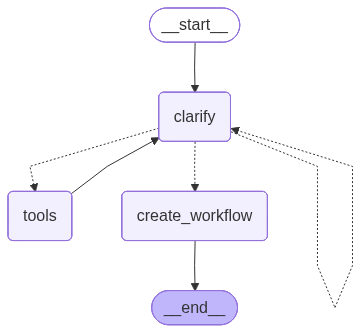

> `author:` Stefanos Panteli<br>
`date:` 2025-09-17<br>
`description:` The Workflow Refiner agent takes a refined user request, asks workflow-focused clarifying questions, and then outputs a buildable workflow graph as a structured WorkflowBundle (root graph plus optional subgraphs).

<br>

# **Table of contents**
&emsp;&emsp;&emsp;🗂️ [**Folder Structure**](#folder-structure)<br>
&emsp;&emsp;&emsp;✅ [**Purpose**](#purpose)<br>
&emsp;&emsp;&emsp;▶️ [**Entry point**](#entry-point)<br>
&emsp;&emsp;&emsp;📥📤 [**Interface**](#interface)<br>
&emsp;&emsp;&emsp;&emsp;&emsp;&emsp;&emsp;📥 [Input](#input)<br>
&emsp;&emsp;&emsp;&emsp;&emsp;&emsp;&emsp;📤 [Output](#output)<br>
&emsp;&emsp;&emsp;🧰 [**Tools and Structured Output**](#tools-and-structured-output)<br>
&emsp;&emsp;&emsp;&emsp;&emsp;&emsp;&emsp;🛠️ [Tools](#tools)<br>
&emsp;&emsp;&emsp;&emsp;&emsp;&emsp;&emsp;🧾 [Schemas](#schemas)<br>
&emsp;&emsp;&emsp;📌 [**Behaviour rules**](#behavior-rules)<br>
&emsp;&emsp;&emsp;🧭 [**Graph structure**](#graph-structure)<br>
&emsp;&emsp;&emsp;&emsp;&emsp;&emsp;&emsp;🧩 [Nodes](#nodes)<br>
&emsp;&emsp;&emsp;&emsp;&emsp;&emsp;&emsp;🔀 [Edges](#edges)<br>
&emsp;&emsp;&emsp;&emsp;&emsp;&emsp;&emsp;🌟 [Graph visualised](#graph-visualised)<br>
&emsp;&emsp;&emsp;🚀 [**Quickstart**](#quickstart)<br>

<br>

# **Folder Structure**
```python
	workflowRefiner/
	├── graphs/
	│	└── workflow_refiner_app.png    # The graph visualised.
	├── workflow_refiner.py             # The langgraph implementation of the agent.
	├── prompts.py                      # The prompts used by clarifier and workflow engineer.
	└── readme.md                       # This file.
```

<br><br>

# **Purpose**
This agent converts a refined user request into a workflow you can implement in a LangGraph-like runtime.

It has two phases:
1. Clarification phase: asks only workflow questions. It avoids domain details unless they affect workflow shape.
2. Synthesis phase: produces a structured WorkflowBundle with:
	- a root WorkflowGraph
	- optional subgraphs referenced by subgraph_id

This matters because code structure will be built based on the suggested workflow.

<br>

# **Entry point**
- App: `workflow_refiner_app`
- Module: `agents/workflowRefiner/workflow_refiner.py`

<br>

# **Interface**
## Input
### InputSchema (MessagesState)
- `orchestrator: bool`  
  If true, the agent calls the clarification orchestrator app to collect answers automatically.
- `clarified_user_input: Optional[str]`  
  The refined user request that will be turned into a workflow.

> *Note* InputSchema extends MessagesState, so it also contains `messages`. The agent stores clarifications and tool results there.

## Output
### OutputSchema
- `workflow: WorkflowBundle`  
  The final workflow bundle.

WorkflowBundle fields:
- `comments: str` Notes about decisions and assumptions.
- `root: WorkflowGraph` The main workflow.
- `subgraphs: Dict[str, WorkflowGraph]` Optional subgraphs referenced by nodes in root.

<br>

# **Tools and Structured Output**
## Tools
1. `tavily_search`
	- Source: TavilySearch.as_tool()
	- Purpose: fetch external context when needed to resolve workflow constraints or shape.
	- Config used:
		- `search_depth="advanced"`
		- `max_results=5`
		- `include_answer=True`

## Schemas
### WorkflowNode
- `name: str` snake_case node name
- `description: str` node description
- `subgraph_id: Optional[str]` reference key into WorkflowBundle.subgraphs

### WorkflowEdge
- `source_name: str`
- `target_name: str`
- `description: str` transition reason and guard intent

### WorkflowGraph
- `type: Literal['reactive_conversational','linear_pipeline','planner_executor','hybrid']`
- `memory: bool` whether the workflow relies on persisted state
- `name: str`
- `description: str`
- `nodes: List[WorkflowNode]`
- `edges: List[WorkflowEdge]`

### WorkflowBundle
- `comments: str`
- `root: WorkflowGraph`
- `subgraphs: Dict[str, WorkflowGraph]`

<br>

# **Behaviour rules**
- Workflow-only clarification:
	- Clarifier asks questions only about how the system runs.
	- If a domain value is missing, the clarifier prefers a minimal assumption instead of asking.

- Tool usage:
	- Clarifier may call `tavily_search` only when it needs external context to resolve workflow constraints.
	- Tools run through ToolNode, and results flow back as ToolMessage.

- Turn-based execution model:
	- No node should model waiting.
	- If the workflow needs user input, it must send a message and end the run.
	- Multi-turn behavior happens across runs using persisted state.

- Workflow synthesis:
	- The workflow engineer LLM returns a WorkflowBundle via structured output.
	- It can create subgraphs for complex steps and link them with `subgraph_id`.

- Start/end normalization:
	- After creating the workflow, the code ensures every graph includes:
		- a `start` node
		- an `end` node
	- It also adds edges to connect them if missing.

<br>

# **Graph structure**
## Nodes
1. **`clarify`**
	- Execution: LLM+TOOLS (via bound tools on clarifier LLM and ToolNode path).
	- Builds a prompt from:
		- `clarified_user_input`
		- prior clarification messages
	- Outcomes:
		- emits “No clarification needed”
		- asks a clarification question and collects an answer
		- triggers a tool call (tavily_search)
		- optionally routes to the clarification orchestrator if `orchestrator=True`

2. **`tools`**
	- ToolNode([tavily_search])
	- Executes tool calls produced by the clarifier LLM.
	- Appends ToolMessage results to state.messages.

3. **`create_workflow`**
	- Execution: LLM (structured output).
	- Uses:
		- conversation history from state.messages
		- optional user feedback loop (interactive confirmation)
	- Produces WorkflowBundle.
	- Post-processes graphs to add missing start/end nodes and edges.

## Edges
- *START* → **`clarify`**
- **`clarify`** → *conditional* ⇢
	- **`create_workflow`** if last message contains “No clarification needed”
	- **`tools`** if a tavily tool call is expected
	- **`clarify`** otherwise (continue clarification loop)
- **`tools`** → **`clarify`**
- **`create_workflow`** → *END*

## Graph visualised
<div align="center">
	
</div>

<br>

# **Quickstart**
```python
from agents.workflowRefiner.workflow_refiner import workflow_refiner_app

graph_input = {
    "messages": [],
    "orchestrator": False,
    "clarified_user_input": "<Output of the input refiner>"
}

response = workflow_refiner_app.invoke(graph_input)

# response:
# {
#   "workflow": <WorkflowBundle>
# }
```
